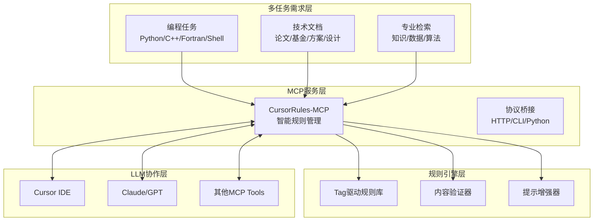
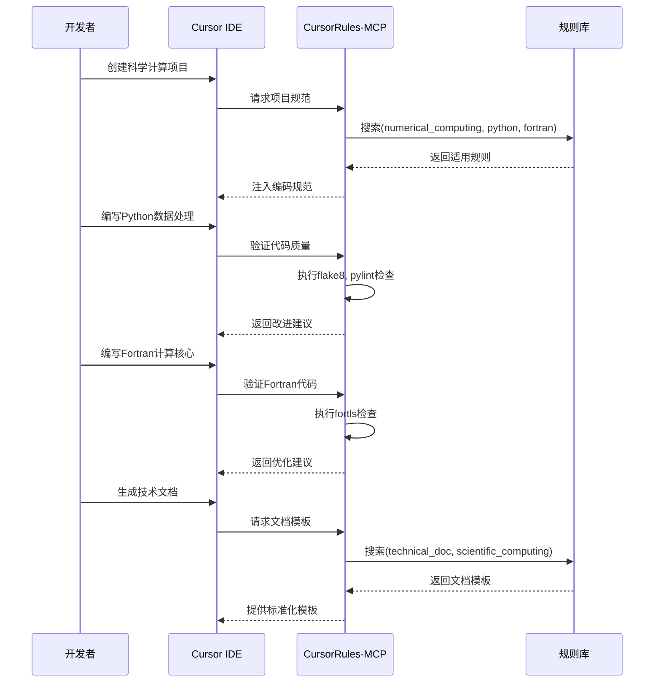
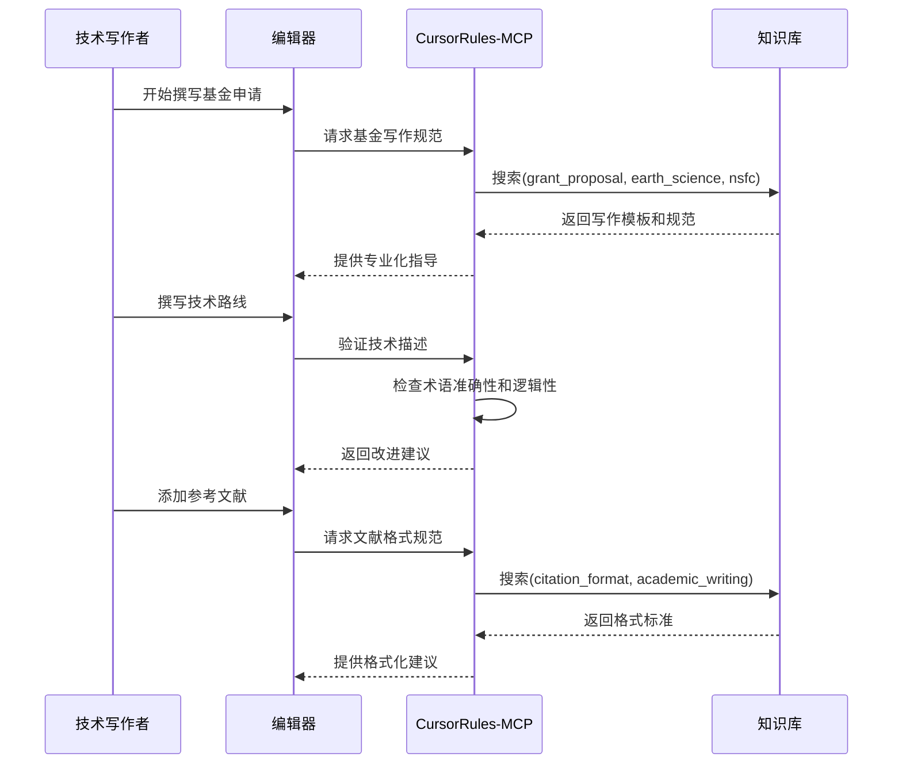

# CursorRules-MCP

[](LICENSE)
[](https://www.python.org/downloads/)
[](https://fastapi.tiangolo.com/)
[](https://github.com/psf/black)

**多领域、多任务、多语言协作的智能规则管理与MCP服务平台**

---

## 🎯 项目愿景

CursorRules-MCP致力于解决现代科研与工程项目中**多领域交叉、多任务并行、多语言协作**的复杂需求。通过构建基于Model Context Protocol (MCP)的智能规则管理平台，实现跨领域知识检索、专业化LLM协作，以及项目内容与风格的连贯性保障。

### 核心使命

- 🔬 **科研工程一体化**：支持从数值计算到文档撰写的全链路专业化
- 🌐 **多领域知识融合**：气象、电离层、测绘、海洋、地球物理等领域的规则库
- 🤖 **LLM智能协作**：通过MCP服务实现AI助手的专业化与规范化
- 📋 **内容风格一致性**：确保项目文档、代码、报告的专业标准统一

---

## 🏗️ 核心理念

### 1. Tag驱动的规则体系

通过多维度标签系统，实现规则的精准检索与智能匹配：

```yaml
# 示例规则标签体系
tags:
  # 编程语言
  languages: [python, cpp, fortran, shell, matlab]
  
  # 任务类型  
  programming_types: [numerical_computing, visualization, data_analysis, gui_development, http_service, llm_mcp]
  
  # 文档类型
  document_types: [paper_polish, review_response, grant_proposal, project_plan, software_design, api_doc]
  
  # 学科领域
  domains: [meteorology, ionosphere, surveying, oceanography, earth_science, geophysics]
  
  # 专业能力
  capabilities: [knowledge_retrieval, data_interface, algorithm_library, formula_rendering]
```

### 2. MCP服务桥接架构



### 3. 专业化能力矩阵

| 能力维度 | 编程任务 | 技术文档 | 专业检索 |
|----------|----------|----------|----------|
| **多语言支持** | Python, C++, Fortran, Shell, MATLAB | Markdown, LaTeX, Word, HTML | 全文本格式 |
| **领域专业化** | 数值计算、可视化、GUI、服务 | 论文、基金、方案、设计 | 知识库、数据接口、算法库 |
| **质量保障** | 代码规范、性能优化、测试 | 格式标准、术语统一、逻辑 | 准确性验证、来源追溯 |
| **协作机制** | 版本控制、模块化、接口 | 模板复用、风格一致、审核 | 智能推荐、关联发现 |

---

## 🚀 快速开始

### 安装

#### 方式一：pip安装（推荐）

```bash
pip install cursorrules-mcp
```

#### 方式二：源码安装

```bash
git clone https://github.com/your-org/cursorrules-mcp.git
cd cursorrules-mcp
pip install -e .
```

#### 方式三：开发环境

```bash
git clone https://github.com/your-org/cursorrules-mcp.git
cd cursorrules-mcp
conda create -n cursorrules python=3.9
conda activate cursorrules
pip install -r requirements.txt
pip install -e .
```

### 配置

#### 1. Cursor IDE配置

在Cursor中配置MCP服务：

```json
// .cursor/mcp_settings.json
{
  "mcpServers": {
    "cursorrules": {
      "command": "cursorrules-mcp",
      "args": ["server"],
      "env": {
        "CURSORRULES_DATA_DIR": "./data",
        "CURSORRULES_LOG_LEVEL": "INFO"
      }
    }
  }
}
```

#### 2. 环境变量配置

```bash
# ~/.bashrc 或 ~/.zshrc
export CURSORRULES_HOST=localhost
export CURSORRULES_PORT=8000
export CURSORRULES_DATA_DIR=/path/to/your/rules
export CURSORRULES_LOG_LEVEL=INFO

# 专业领域配置
export CURSORRULES_DEFAULT_DOMAIN=earth_science
export CURSORRULES_DEFAULT_LANGUAGE=python
```

#### 3. 配置文件

```yaml
# cursorrules.yaml
server:
  host: localhost
  port: 8000
  workers: 4
  
rules:
  data_dir: data/rules
  templates_dir: data/templates
  cache_ttl: 3600
  
domains:
  # 地球科学领域配置
  earth_science:
    languages: [python, fortran, cpp]
    data_sources: [ncep, ecmwf, igs]
    algorithms: [kalman_filter, fft, interpolation]
  
  # 电离层研究配置  
  ionosphere:
    languages: [python, matlab, fortran]
    data_sources: [madrigal, cedar, cosmic]
    models: [iri, msis, hwm]

validation:
  timeout: 30
  max_rules: 10
  output_mode: detailed
  
  # 多语言验证工具配置
  tools:
    python: [flake8, pylint, black, mypy]
    cpp: [clang-tidy, cppcheck]
    fortran: [fortls, fprettify]
    shell: [shellcheck]
```

---

## 💡 核心功能与应用场景

### 1. 编程任务支持

#### 数值计算项目
```bash
# 搜索数值计算相关规则
cursorrules-mcp search --tags "numerical_computing,python,fortran" --domains "earth_science"

# 验证数值计算代码
cursorrules-mcp validate ./src/numerical_solver.py --languages python --domains scientific_computing
```

#### GUI开发项目
```bash
# 获取GUI开发规范
cursorrules-mcp search --tags "gui_development,python" --frameworks "qt,tkinter"

# 验证GUI代码风格
cursorrules-mcp validate ./gui/ --recursive --output_mode detailed
```

#### HTTP服务开发
```bash
# 搜索API设计规范
cursorrules-mcp search --tags "http_service,api_design" --languages python

# 增强API文档提示
cursorrules-mcp enhance "设计RESTful API" --domains web_service --languages python
```

### 2. 技术文档撰写

#### 学术论文润色
```bash
# 搜索论文写作规范
cursorrules-mcp search --tags "paper_polish,academic_writing" --domains "ionosphere,meteorology"

# 验证论文格式
cursorrules-mcp validate ./paper.md --document_type academic_paper --output_mode detailed
```

#### 基金申请书
```bash
# 获取基金写作模板
cursorrules-mcp search --tags "grant_proposal" --domains "earth_science" --funding_agency "nsfc,nasa"

# 增强基金申请提示
cursorrules-mcp enhance "撰写NSFC基金申请" --domains earth_science --document_type grant_proposal
```

#### 项目技术方案
```bash
# 搜索技术方案模板
cursorrules-mcp search --tags "project_plan,software_design" --domains "geophysics"

# 验证方案文档结构
cursorrules-mcp validate ./project_proposal.md --document_type technical_proposal
```

### 3. 专业检索能力

#### 知识检索
```bash
# 检索电离层相关知识
cursorrules-mcp search --query "电离层TEC建模" --domains ionosphere --knowledge_type research_papers

# 检索数值方法文档
cursorrules-mcp search --tags "numerical_methods,documentation" --languages "python,fortran"
```

#### 数据接口检索
```bash
# 搜索气象数据接口
cursorrules-mcp search --tags "data_interface,meteorology" --data_sources "ncep,ecmwf"

# 检索海洋数据服务
cursorrules-mcp search --domains oceanography --capability data_download --format netcdf
```

#### 算法库检索
```bash
# 搜索信号处理算法
cursorrules-mcp search --tags "algorithm_library,signal_processing" --languages "python,cpp"

# 检索地球物理反演方法
cursorrules-mcp search --domains geophysics --algorithm_type inversion --languages fortran
```

---

## 🔧 使用指南

### CLI命令详解

```bash
# 规则搜索
cursorrules-mcp search [OPTIONS]
  --query TEXT              # 搜索关键词
  --languages TEXT          # 编程语言 (python,cpp,fortran,shell)
  --domains TEXT            # 学科领域 (meteorology,ionosphere,oceanography)
  --tags TEXT               # 标签过滤
  --document_types TEXT     # 文档类型
  --limit INTEGER           # 结果数量限制
  --output_format TEXT      # 输出格式 (json,yaml,table)

# 内容验证  
cursorrules-mcp validate [CONTENT] [OPTIONS]
  --file PATH               # 验证文件
  --languages TEXT          # 指定语言
  --domains TEXT            # 指定领域
  --output_mode TEXT        # 输出模式 (simple,detailed,json)
  --recursive               # 递归验证目录

# 提示增强
cursorrules-mcp enhance [PROMPT] [OPTIONS]
  --languages TEXT          # 目标语言
  --domains TEXT            # 目标领域
  --task_type TEXT          # 任务类型
  --complexity TEXT         # 复杂度级别

# 规则导入
cursorrules-mcp import [PATH] [OPTIONS]
  --type TEXT               # 资源类型 (rules,templates)
  --format TEXT             # 文件格式 (markdown,yaml,json)
  --validate                # 导入前验证
  --merge                   # 合并冲突规则

# 统计分析
cursorrules-mcp stats [OPTIONS]
  --resource_type TEXT      # 资源类型
  --domains TEXT            # 领域过滤
  --languages TEXT          # 语言过滤
  --export PATH             # 导出统计报告
```

### MCP协议调用

```python
# Python客户端示例
from cursorrules_mcp import RuleEngine

async def main():
    engine = RuleEngine()
    await engine.initialize()
    
    # 多维度规则搜索
    results = await engine.search_rules(
        query="数值积分算法",
        languages=["python", "fortran"],
        domains=["numerical_computing"],
        tags=["algorithm", "integration"]
    )
    
    # 跨领域内容验证
    validation = await engine.validate_content(
        content=code_content,
        languages=["python"],
        domains=["earth_science", "data_analysis"]
    )
    
    # 专业化提示增强
    enhanced = await engine.enhance_prompt(
        base_prompt="编写气象数据处理程序",
        languages=["python"],
        domains=["meteorology"],
        task_type="data_analysis"
    )
```

### HTTP API调用

```bash
# 启动HTTP服务
cursorrules-mcp serve --host 0.0.0.0 --port 8000

# API调用示例
curl -X POST http://localhost:8000/mcp/jsonrpc \
  -H "Content-Type: application/json" \
  -d '{
    "jsonrpc": "2.0",
    "method": "search_rules",
    "params": {
      "query": "电离层建模",
      "languages": "python,fortran",
      "domains": "ionosphere,earth_science",
      "limit": 10
    },
    "id": 1
  }'
```

---

## 📊 典型工作流

### 工作流1：多语言科学计算项目



### 工作流2：跨领域文档撰写



---

## 🌐 部署与集成

### Docker部署

```bash
# 构建镜像
docker build -t cursorrules-mcp .

# 运行服务
docker run -d \
  --name cursorrules-mcp \
  -p 8000:8000 \
  -v ./data:/app/data \
  -v ./config:/app/config \
  -e CURSORRULES_LOG_LEVEL=INFO \
  -e CURSORRULES_DOMAIN=earth_science \
  cursorrules-mcp
```

### Kubernetes部署

```yaml
# k8s/deployment.yaml
apiVersion: apps/v1
kind: Deployment
metadata:
  name: cursorrules-mcp
spec:
  replicas: 3
  selector:
    matchLabels:
      app: cursorrules-mcp
  template:
    metadata:
      labels:
        app: cursorrules-mcp
    spec:
      containers:
      - name: cursorrules-mcp
        image: cursorrules-mcp:latest
        ports:
        - containerPort: 8000
        env:
        - name: CURSORRULES_DATA_DIR
          value: "/data"
        - name: CURSORRULES_LOG_LEVEL
          value: "INFO"
      volumes:
      - name: rules-data
        persistentVolumeClaim:
          claimName: cursorrules-pvc
```

### 与其他MCP服务集成

```json
// 多MCP服务配置示例
{
  "mcpServers": {
    "cursorrules": {
      "command": "cursorrules-mcp",
      "args": ["server"]
    },
    "filesystem": {
      "command": "npx",
      "args": ["@modelcontextprotocol/server-filesystem", "/path/to/project"]
    },
    "git": {
      "command": "npx", 
      "args": ["@modelcontextprotocol/server-git", "--repository", "/path/to/repo"]
    }
  }
}
```

---

## 📚 相关文档

- 📖 **[技术架构](docs/techs.md)** - 完整的技术架构与实现细节
- 📝 **[规则编写指南](docs/rules.md)** - 如何编写和管理专业规则
- 🔧 **[API参考文档](docs/api.md)** - 详细的API接口说明
- 🎯 **[最佳实践](docs/best_practices.md)** - 多领域应用的最佳实践
- 🔍 **[Tag体系设计](docs/tags.md)** - 标签系统的设计与使用
- 🌍 **[多领域支持](docs/domains.md)** - 各学科领域的专业化配置

---

## 🤝 贡献指南

### 贡献类型

1. **规则贡献** - 提交新的专业领域规则
2. **模板贡献** - 提供文档模板和最佳实践
3. **验证器贡献** - 开发新的代码/文档验证工具
4. **领域扩展** - 支持新的学科领域和应用场景

### 贡献流程

```bash
# 1. Fork项目并创建功能分支
git checkout -b feature/new-domain-support

# 2. 添加规则或功能
# 规则文件: data/rules/domains/your_domain/
# 模板文件: data/templates/domains/your_domain/
# 验证器: cursorrules_mcp/validators/your_language.py

# 3. 测试验证
cursorrules-mcp validate ./examples/your_domain/ --recursive
cursorrules-mcp import ./data/rules/domains/your_domain/ --validate

# 4. 提交更改
git commit -m "feat: 添加[领域名]专业规则支持"
git push origin feature/new-domain-support

# 5. 创建Pull Request
```

---

## 🎯 未来规划

### 短期目标 (v1.5.x)
- [ ] 增强多语言验证器支持 (MATLAB, R, Julia)
- [ ] 扩展更多学科领域规则库 (天文学, 生物信息学)
- [ ] 改进智能推荐算法
- [ ] 完善文档模板系统

### 中期目标 (v2.0.x)
- [ ] AI驱动的规则自动生成
- [ ] 实时协作与版本控制
- [ ] 分布式规则库支持
- [ ] 高级语义检索能力

### 长期愿景 (v3.0.x)
- [ ] 跨机构规则库共享平台
- [ ] 自适应学习与优化系统
- [ ] 多模态内容支持 (图表, 公式, 代码)
- [ ] 国际化与本地化支持

---

## 📄 许可证

本项目采用 MIT 许可证 - 查看 [LICENSE](LICENSE) 文件了解详情。

---

## 📞 联系我们

**项目维护**: Mapoet  
**机构**: NUS/STAR  
**版本**: v1.4.0  
**更新**: 2025-01-23  

**技术支持**: 
- 📧 Email: [your-email@example.com]
- 💬 Issues: [GitHub Issues](https://github.com/your-org/cursorrules-mcp/issues)
- 📖 Wiki: [项目Wiki](https://github.com/your-org/cursorrules-mcp/wiki)

---

*CursorRules-MCP - 让AI助手更专业，让协作更智能* 🚀