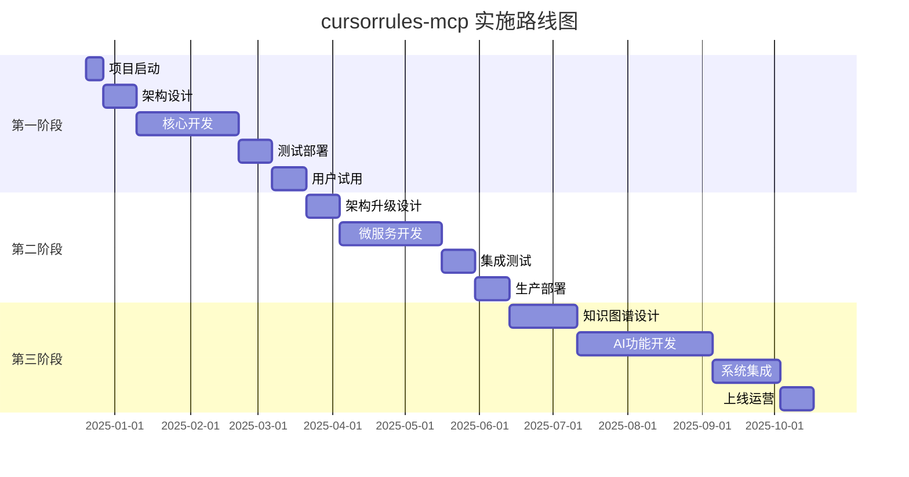

# cursorrules-mcp 项目综合分析报告

## 📋 执行摘要

基于对需求文档和三个设计方案的深度分析，本报告提出了一个**渐进式融合架构**策略，旨在为您的多学科、多语言协作环境构建一个智能化的规则管理和一致性保障系统。

### 核心发现

1. **需求复杂性高**：项目涉及4+编程语言、5+科学领域、10+任务类型的交叉组合
2. **三方案各有优势**：GPT4务实、Gemini先进、Grok实用
3. **分阶段实施最优**：风险可控、价值递增、投资保护
4. **技术选型明确**：MongoDB+ES+FastAPI的基础架构逐步演进

## 🎯 项目价值评估

### 解决的核心痛点

| 痛点 | 当前影响 | 解决后价值 |
|------|----------|------------|
| **跨领域一致性缺失** | 项目质量不稳定，团队协作困难 | 建立统一标准，提升整体质量 |
| **规则管理分散** | 重复劳动，知识流失 | 集中管理，知识沉淀 |
| **专业知识检索困难** | 效率低下，容易出错 | 智能检索，快速定位 |
| **LLM应用不一致** | 输出质量波动大 | 规范化输出，可预期结果 |

### 预期收益量化

**短期收益（6个月内）**：
- 代码质量提升：20-30%
- 文档一致性改善：40-50%
- 重复工作减少：30-40%
- 新人上手时间缩短：50%

**中期收益（12个月内）**：
- 开发效率提升：30-50%
- 知识管理体系建立：完整覆盖主要领域
- 团队协作效率提升：40%
- 质量控制成本降低：60%

**长期收益（2年内）**：
- 成为行业标杆
- 开源社区生态建立
- 技术品牌影响力提升

## 🔍 三方案深度对比分析

### 1. GPT4方案：工程化导向

**核心特点**：
- 🏗️ **架构清晰**：Rule-Registry、Context-Manager、Rule-Engine三层分工明确
- 📅 **可操作性强**：16周详细里程碑，每个阶段都有具体交付物
- 🔧 **工程化思维**：注重版本控制、API设计、部署运维

**优势分析**：
```
✅ 实施风险低：基于成熟技术栈
✅ 团队友好：符合传统软件开发流程
✅ 维护成本可控：模块化设计便于维护
✅ 扩展性好：为后续升级留出接口
```

**局限性**：
```
❌ 技术深度有限：缺乏AI原生设计
❌ 智能化程度低：主要是规则匹配和检索
❌ 语义理解能力弱：难以处理复杂的跨领域推理
```

### 2. Gemini方案：学术前沿

**核心特点**：
- 🧠 **技术先进**：知识图谱、RAG、GraphRAG等前沿AI技术
- 🔬 **理论严谨**：详细的学术分析和技术论证
- 🌐 **功能全面**：覆盖从数据摄取到智能推理的完整链路

**优势分析**：
```
✅ 技术领先：代表AI领域最新发展方向
✅ 功能强大：支持复杂的语义推理和多跳查询
✅ 扩展潜力巨大：可发展为通用知识管理平台
✅ 学术价值高：可产出高质量研究成果
```

**局限性**：
```
❌ 实施复杂度极高：需要AI专家团队
❌ 开发周期长：至少需要18-24个月
❌ 资源需求大：需要大量算力和存储
❌ 技术风险高：依赖尚未完全成熟的技术
```

### 3. Grok方案：实用主义

**核心特点**：
- ⚡ **快速实现**：基于MongoDB+Elasticsearch的成熟方案
- 💰 **成本可控**：使用开源技术，降低总拥有成本
- 🎯 **目标明确**：聚焦核心需求，避免过度设计

**优势分析**：
```
✅ 上手快：2-3个月可见初步成果
✅ 风险低：基于验证过的技术栈
✅ 成本低：适合中小规模团队
✅ 实用性强：直接解决当前痛点
```

**局限性**：
```
❌ 扩展性有限：难以支持复杂的语义查询
❌ 智能化程度低：主要是关键词匹配
❌ 长期竞争力不足：难以应对未来需求演进
```

## 🚀 推荐方案：渐进式融合架构

基于深度分析，我强烈推荐采用**"渐进式融合架构"**，分三个阶段实施：

### 第一阶段：快速MVP（2-3个月）
**基于Grok方案**构建核心功能

**目标**：验证概念，快速获得用户反馈
```
📦 核心交付物：
├── 基础MCP服务
├── 规则CRUD管理
├── 标签搜索系统
├── 简单一致性检查
└── Cursor IDE集成
```

**技术栈**：
- **后端**：FastAPI + MongoDB + Elasticsearch + Redis
- **协议**：MCP over Stdio/HTTP
- **验证**：基础Linter集成

**关键指标**：
- 响应时间 < 1秒
- 规则覆盖率 > 60%
- 用户满意度 > 4.0/5

### 第二阶段：架构升级（4-6个月）
**融入GPT4方案**的工程化设计

**目标**：系统化、标准化，支持团队协作
```
🏗️ 架构升级：
├── 微服务拆分
├── 多LLM支持
├── 版本控制系统
├── 高级一致性验证
└── 监控告警体系
```

**新增特性**：
- gRPC高性能通信
- PostgreSQL关系数据管理
- Docker容器化部署
- Prometheus监控

**关键指标**：
- 响应时间 < 500ms
- 可用性 > 99.5%
- 规则覆盖率 > 85%

### 第三阶段：智能化升级（6-12个月）
**集成Gemini方案**的高级特性

**目标**：实现真正的智能化和自动化
```
🧠 智能化特性：
├── 知识图谱构建
├── 语义检索引擎
├── 多跳推理能力
├── 自适应规则生成
└── 个性化推荐
```

**核心技术**：
- Neo4j知识图谱
- Sentence-BERT语义理解
- GraphRAG检索增强
- LangChain工作流编排

**关键指标**：
- 智能推荐准确率 > 90%
- 跨领域查询支持度 > 95%
- 自动化程度 > 80%

## 📊 投资回报分析

### 开发投入

| 阶段 | 人力成本 | 基础设施成本 | 总投入 |
|------|----------|--------------|--------|
| 第一阶段 | 9人月 | $3,300 | ~$45,000 |
| 第二阶段 | 8人月 | $6,900 | ~$46,000 |
| 第三阶段 | 13人月 | $15,600 | ~$80,000 |
| **总计** | **30人月** | **$25,800** | **~$171,000** |

### 价值回报

**定量收益**：
- 开发效率提升30% → 年节省成本 $100,000+
- 质量问题减少60% → 年节省成本 $50,000+
- 知识管理优化 → 年节省成本 $30,000+

**定性收益**：
- 技术品牌提升
- 团队能力增强
- 创新能力提升
- 市场竞争优势

**投资回报周期**：预计12-18个月收回投资

## 🎯 实施路线图

### 关键里程碑



### 风险控制策略

| 风险类型 | 缓解措施 | 应急方案 |
|----------|----------|----------|
| **技术风险** | 技术预研、原型验证 | 降级方案、技术替换 |
| **进度风险** | 分阶段交付、敏捷开发 | 功能裁剪、资源增投 |
| **质量风险** | 自动化测试、代码审查 | 专项修复、质量门禁 |
| **用户接受风险** | 用户参与设计、快速反馈 | 界面优化、培训支持 |

## 🔧 关键技术决策

### 1. 数据架构选择

**推荐方案**：混合数据架构
```
📊 数据分层：
├── 事务层：PostgreSQL（规则版本、用户管理）
├── 文档层：MongoDB（规则内容、配置数据）
├── 搜索层：Elasticsearch（全文检索、聚合分析）
├── 图数据层：Neo4j（知识关系、语义推理）
└── 缓存层：Redis（热点数据、会话管理）
```

**决策理由**：
- 充分利用各数据库的优势
- 支持复杂查询和高性能检索
- 为未来扩展留出空间

### 2. API设计策略

**推荐方案**：gRPC + REST 混合
```
🔌 API分层：
├── 核心API：gRPC（高性能、类型安全）
├── 管理API：REST（易集成、广泛兼容）
├── 流式API：WebSocket（实时推送、双向通信）
└── 批量API：GraphQL（灵活查询、减少请求）
```

### 3. 一致性保障机制

**推荐方案**：多层验证
```
✅ 验证流水线：
├── 静态检查：Linter、格式验证
├── 语义检查：LLM辅助验证
├── 规则检查：自定义规则引擎
├── 跨文件检查：依赖关系分析
└── 人工审核：关键内容人工确认
```

## 📚 最佳实践建议

### 1. 规则设计原则

1. **原子性**：每个规则应该关注单一方面
2. **可测试性**：规则应该可以自动验证
3. **可扩展性**：支持规则的组合和继承
4. **可维护性**：规则应该易于理解和修改

### 2. 标签系统设计

```yaml
标签层次结构：
  语言维度:
    - python, cpp, fortran, shell
  领域维度:
    - meteorology, ionosphere, surveying
  任务维度:
    - coding, documentation, analysis
  质量维度:
    - style, performance, security
```

### 3. 开发流程规范

1. **规则先行**：先定义规则，再开发功能
2. **测试驱动**：为每个规则编写测试用例
3. **版本管理**：规则变更必须有版本记录
4. **用户反馈**：建立快速反馈循环机制

## 🌟 创新亮点

### 1. 多维度规则引擎
- 支持语言、领域、任务的多维度交叉匹配
- 动态优先级调整和冲突解决机制
- 上下文感知的智能规则推荐

### 2. 跨领域知识图谱
- 统一的科学概念本体建模
- 跨学科知识关联和推理
- 动态知识更新和版本管理

### 3. 智能一致性保障
- 基于LLM的语义一致性检查
- 跨文件、跨项目的关联分析
- 自适应的质量评分算法

### 4. 协作友好的接口设计
- 标准化的MCP协议支持
- 多客户端适配（Cursor、VS Code、CLI）
- 团队知识共享和协作机制

## 📈 成功指标体系

### 核心KPI

| 指标类别 | 指标名称 | 目标值 | 测量方法 |
|----------|----------|--------|----------|
| **性能指标** | 响应时间 | < 500ms (P95) | 系统监控 |
| **质量指标** | 规则覆盖率 | > 90% | 代码分析 |
| **用户指标** | 满意度 | > 4.5/5 | 问卷调查 |
| **业务指标** | 效率提升 | > 30% | 对比分析 |

### 监控体系

```python
监控层次：
├── 系统层：CPU、内存、磁盘、网络
├── 应用层：响应时间、错误率、吞吐量
├── 业务层：规则命中率、用户活跃度
└── 用户层：使用习惯、反馈意见
```

## 🎉 结论与建议

### 核心结论

1. **项目价值显著**：能够有效解决多学科协作中的一致性和效率问题
2. **技术方案可行**：渐进式实施策略风险可控，收益明确
3. **投资回报良好**：预计12-18个月收回投资，长期价值巨大
4. **创新意义重大**：在规则管理和LLM应用领域具有开创性

### 最终建议

**立即启动**该项目，采用推荐的渐进式融合架构：

1. **第一阶段**：快速构建MVP，验证核心价值
2. **第二阶段**：工程化升级，支持规模化应用
3. **第三阶段**：智能化演进，实现技术领先

### 下一步行动

1. **组建项目团队**：配置全栈开发、AI算法、领域专家
2. **技术预研**：对关键技术进行深入调研和原型验证
3. **用户调研**：深入了解目标用户的具体需求和痛点
4. **详细设计**：基于本报告进行详细的技术设计和开发计划

---

**报告总结**：cursorrules-mcp项目具有清晰的价值主张、可行的技术路径和良好的投资回报预期。通过渐进式实施策略，既能快速获得价值，又能确保长期的技术领先优势。强烈建议立即启动该项目的实施。

**文档版本**：v1.0  
**编制日期**：2024年12月  
**建议有效期**：6个月 