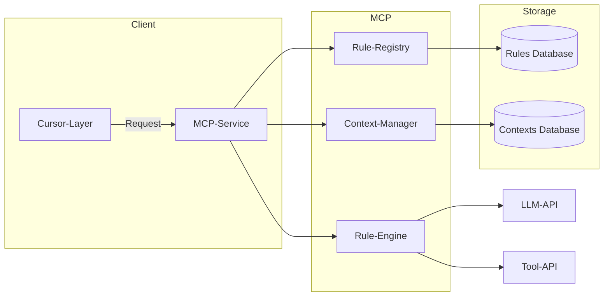

## 项目背景与目标

在多种领域与任务（编程、技术文档撰写、专业检索、算法接口等）交叉的环境下，需求复杂多样，且不同模块之间需要保持**内容**与**风格**的一致性。为此，设计并实现一套基于CursorRules的Model Context Protocol (MCP) 服务，能够：

1. **集中管理**各类任务规则（Rules）：包括语言、领域、格式、风格、工具使用规范等。
2. **跨任务检索**：根据项目标签(Tag)与上下文(context)检索匹配的规则集，并动态注入到LLM。
3. **一致性保障**：在文档与代码生成过程中，自动校验并应用指定风格与内容模板，以实现跨文件、跨模块的连贯性。

## 总体架构



* **Cursor-Layer**：项目中集成的Cursor，负责捕获用户请求、标注Tag与Project-ID，并与MCP-Service交互。
* **MCP-Service**：MCP核心服务，包含规则注册、检索与应用；上下文管理；以及与LLM或其他Tool的接口。
* **Rule-Registry**：存储与管理所有Rules元数据与内容。
* **Context-Manager**：维护各项目的上下文快照（已生成内容、风格、标签等）。
* **Rule-Engine**：执行规则匹配、注入与校验，并协调调用LLM-API或Tool-API完成生成任务。

## 模块设计

### 1. Rule-Registry 模块

* **数据模型**：

  * RuleID, TagList, Domain, Language, Type, Version, ContentTemplate, StyleGuide
* **接口**：

  * `registerRule(rule)`
  * `searchRules(tags, domain, language)`
  * `updateRule(ruleID, newContent)`

### 2. Context-Manager 模块

* **数据模型**：

  * ProjectID, ContextSnapshot, AppliedRules\[], VersionHistory
* **接口**：

  * `initContext(projectID, baseTags)`
  * `getContext(projectID)`
  * `updateContext(projectID, additions)`

### 3. Rule-Engine 模块

* **核心功能**：

  1. 接收Cursor传入的请求与上下文
  2. 根据Tag检索匹配Rules
  3. 注入Rules（模板、风格、校验脚本）到LLM Prompt或Tool调用中
  4. 对LLM输出进行Post-Processing，运行Style/Rule Check
  5. 更新Context
* **接口**：

  * `applyRules(request, projectID)` → 返回生成结果

### 4. LLM-API & Tool-API 模块

* 对接OpenAI/私有LLM接口
* 支持调用代码执行环境、SFTP、数据库查询、论文检索服务等

## 具体实现技术栈

* **后端**：Python (FastAPI)、Node.js (Express)
* **数据库**：PostgreSQL (规则与上下文)、Redis (缓存)
* **消息队列**：RabbitMQ 或 Kafka
* **认证授权**：JWT/OAuth2
* **部署**：Docker+Kubernetes

## 样例文件与测试

### 1. 样例Rule定义 (YAML格式)

```yaml
- rule_id: python_data_analysis_v1
  tags: [python, data-analysis]
  domain: data_science
  language: python
  type: code
  version: 1.0
  content_template: |
    """
    # 数据分析脚本
    import pandas as pd
    # 输入文件: {input_file}
    df = pd.read_csv('{input_file}')
    {analysis_steps}
    df.to_csv('{output_file}', index=False)
    """
  style_guide:
    - 注释必须使用英文
    - 变量命名使用snake_case
```

### 2. Cursor调用示例 (JavaScript)

```javascript
const cursor = require('cursorrules-mcp');
async function generateAnalysis() {
  const result = await cursor.request({
    projectID: 'proj123',
    tags: ['python','data-analysis'],
    input: { input_file: 'data.csv', analysis_steps: 'df.describe()', output_file: 'summary.csv' }
  });
  console.log(result);
}
generateAnalysis();
```

### 3. 测试用例 (pytest)

```python
import pytest
from mcp_service import RuleRegistry, RuleEngine

def test_register_and_search():
    rr = RuleRegistry()
    rr.register_rule(sample_rule)
    rules = rr.search_rules(['python'], 'data_science', 'python')
    assert len(rules) == 1

def test_apply_rules_consistency():
    engine = RuleEngine()
    output = engine.apply_rules(request, 'proj123')
    assert '# 数据分析脚本' in output
```

## 里程碑规划

| 序号 | 里程碑                               | 时间（周） |
| -- | --------------------------------- | ----- |
| 1  | 需求确认与架构设计                         | 1–2   |
| 2  | 数据模型与接口定义                         | 3–4   |
| 3  | 基础Rule-Registry与Context-Manager实现 | 5–7   |
| 4  | Rule-Engine核心逻辑开发                 | 8–10  |
| 5  | LLM & Tool集成测试                    | 11–12 |
| 6  | 样例文件与自动化测试                        | 13–14 |
| 7  | 部署与上线                             | 15–16 |

---

以上方案涵盖了设计思路、模块划分、实现技术、样例与测试，以及项目里程碑，可作为项目启动与实施的基础蓝图。如需深入细化，请告知具体模块或领域（如气象领域文档、GUI开发等）。
