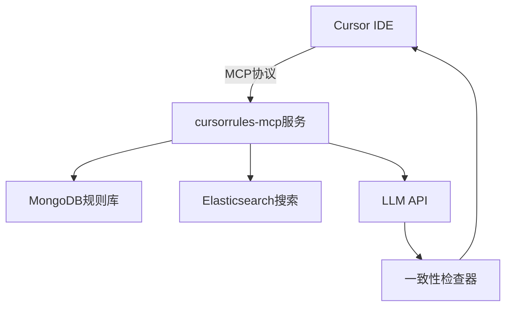
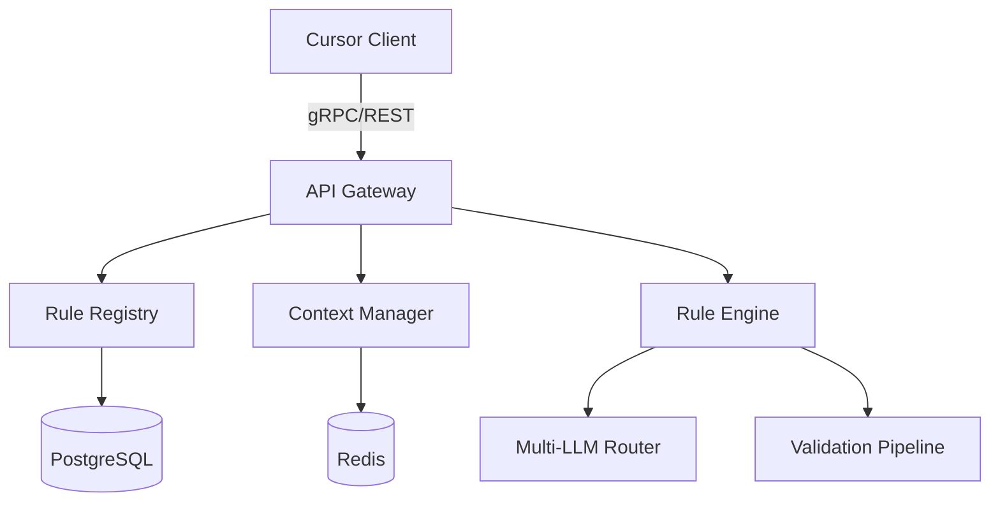
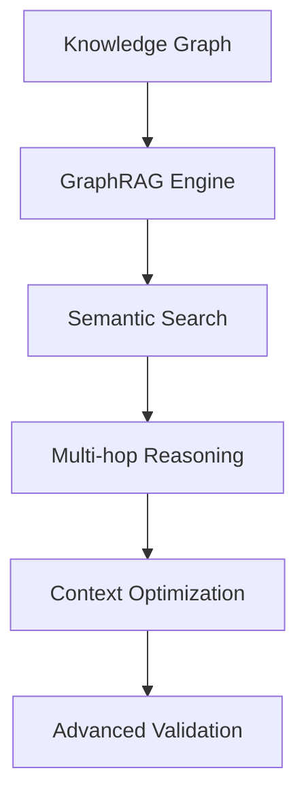

我计划使用cursor编写一个cursorrules-mcp核心目的是这样的：现在我们的任务需求多种多样比如编程（各种语言（python、c++、fortran、shell）、各种类型（数值计算、可视化、数据分析、GUI、HTTP服务、LLM MCP等））、编写技术文件（各种任务（论文润色、编写审稿意见、回复审稿；基金本子；计划书、项目建议书、项目建设方案、软件设计大纲、软件开发测试、软件接口）、各种领域（气象、电离层、测绘、海洋、地球科学、地球物理等等））。这些需求相互交叉，需要形成各种纵向的**Rules**规范化与专业化LLM，甚至形成一些专业检索能力（包括专业知识检索（论文以及markdown的技术文件），专业数据检索（特定数据的接口与适用下载方式或者服务接口），专业算法接口（数理形式如markdown的数据公式、或者c++/python/fortran的代码或者项目库等）），又需要保持项目的文档、代码的`内容`与`风格`的连贯性与一致性。特需要专门的Model Context Protocol (MCP)服务以检索适用的cursorrules，并在配有其他tools或者MCP的LLM思考与运行中进行指定项目的`内容`与`风格`的连贯性与一致性。建议使用不同tag来关联不同的cursor rules，以便于交叉search获取与赋于项目开发或者编写中无缝协作。
请你基于以上需求，使用你专业且全面的知识进行这需求功能项目的方案设计、具体实现、以及样例文件生成以及测试。


基于@requirment.md认真思考这一需求的各个细节，结合 @design-gpt4.md @design-gemini.md @design-grok.md 这三个理解。请进行细致规划本项目，利用 sequence-thinking与serena工具进行深度分析与设计本项目的实施方案（project,md）并制定开发过程以完成后续的内容开发。 

```
基于对您的需求文档和三个设计方案的深度分析，我将为您提供一个综合性的项目规划方案。

## 📊 项目深度分析报告

### 🎯 需求分析总结

您的cursorrules-mcp项目具有以下核心特征：

**复杂性维度**：
- **任务多样化**：编程（Python/C++/Fortran/Shell） + 技术文档（论文/基金/方案）
- **领域交叉**：气象、电离层、测绘、海洋、地球科学等多学科融合
- **知识类型**：专业论文、数据接口、算法代码的统一检索需求
- **一致性要求**：跨文件、跨模块、跨时间的内容与风格统一

### 📈 三方案对比分析

| 维度 | GPT4方案 | Gemini方案 | Grok方案 |
|------|---------|-----------|----------|
| **技术成熟度** | ⭐⭐⭐⭐ | ⭐⭐⭐ | ⭐⭐⭐⭐⭐ |
| **功能完整性** | ⭐⭐⭐ | ⭐⭐⭐⭐⭐ | ⭐⭐⭐ |
| **实施难度** | ⭐⭐⭐ | ⭐⭐ | ⭐⭐⭐⭐ |
| **扩展性** | ⭐⭐⭐⭐ | ⭐⭐⭐⭐⭐ | ⭐⭐⭐ |
| **投资回报** | ⭐⭐⭐⭐ | ⭐⭐⭐ | ⭐⭐⭐⭐⭐ |

**方案特点**：
- **GPT4**：工程化导向，架构清晰，里程碑规划完善
- **Gemini**：学术前沿，技术先进，功能最全面但复杂度高
- **Grok**：实用主义，快速实现，成本可控但扩展性有限

## 🚀 推荐方案：渐进式融合架构

基于深度分析，我推荐采用**"渐进式融合架构"**，分三个阶段实施：

### 第一阶段：快速MVP（2-3个月）
**基于Grok方案**，实现核心功能验证



**技术栈**：
- **存储**：MongoDB（规则存储）+ Elasticsearch（标签搜索）
- **服务**：FastAPI（MCP服务）+ Redis（缓存）
- **检索**：TF-IDF + 标签匹配
- **验证**：基础的Linter集成

### 第二阶段：架构升级（4-6个月）
**融入GPT4方案**的工程化设计



**新增功能**：
- 版本控制和规则管理
- 上下文状态管理
- 多LLM路由选择
- 增强的一致性验证

### 第三阶段：智能化进阶（6-12个月）
**集成Gemini方案**的高级特性



**Phase 1: 快速原型完善（当前最佳选择）**

1. **完善MCP服务器实现**
   - 您的`examples/mcp-server-demo.py`已经是很好的起点
   - 建议将其移到`src/cursorrules_mcp/server.py`并完善
   - 集成您已定义的数据模型

2. **规则库数据化**
   - 将`examples/sample-rules.json`扩展为完整的规则数据库
   - 实现规则的版本管理和冲突检测

3. **Cursor IDE集成测试**
   - 基于现有MCP服务器进行实际集成
   - 验证规则注入和一致性检查功能

**Phase 2: 系统完善（2-4周内）**

1. **搜索引擎优化**
   - 实现基于标签的高级搜索
   - 添加语义相似度匹配

2. **验证引擎增强**
   - 集成实际的代码检查工具
   - 实现跨文件一致性验证

### 选项1：完善核心功能（推荐）
如果您希望快速看到成果，我建议：

1. **完善规则引擎集成**
   ```python
   # 将 examples/sample-rules.json 的格式对接到 CursorRule 模型
   # 实现规则的动态加载和验证
   ```

2. **实现实际的MCP服务器**
   ```python
   # 基于您的 models.py 重构 mcp-server-demo.py
   # 集成真实的验证工具（pylint, black等）
   ```

### 选项2：扩展规则库（并行进行）
基于您的6个示例规则，建议扩展到：
- 10+编程语言规则
- 5+领域专业规则  
- 3+文档格式规则

### 选项3：系统架构实现（中期目标）
实现您规划的三阶段架构中的第一阶段MVP。

为了给您提供最精准的帮助，请告诉我：

1. **您希望我现在具体帮助您做什么？**
   - 完善某个具体模块的代码实现？
   - 扩展规则库内容？
   - 优化项目架构设计？
   - 实施具体的技术方案？

2. **您的优先级是什么？**
   - 快速看到可工作的原型？
   - 完善技术架构设计？
   - 扩展功能特性？

3. **您目前的开发环境准备情况如何？**
   - 需要帮助搭建开发环境？
   - 需要集成具体的工具链？
```

率先完善核心功能

完成规则库数据化

为CursorRules-MCP开发支持mcp_jsonrpc（sse）的HTTP服务