# CursorRules-MCP 技术架构报告

**版本**: v1.4.0  
**日期**: 2025-01-23  
**作者**: Mapoet  
**机构**: NUS/STAR  

---

## 📋 技术概览

CursorRules-MCP是一个面向**多领域、多任务、多语言协作**的智能规则管理与MCP服务平台。项目通过构建基于Model Context Protocol (MCP)的分布式架构，实现跨领域知识检索、专业化LLM协作，以及科研工程项目的内容与风格连贯性保障。

### 🎯 项目定位与使命

| 维度 | 描述 |
|------|------|
| **目标用户** | 科研人员、工程师、技术写作者、多领域协作团队 |
| **应用场景** | 多语言编程(Python/C++/Fortran/Shell)、技术文档撰写(论文/基金/方案)、专业知识检索 |
| **技术特色** | Tag驱动规则体系、MCP桥接服务、多领域专业化、智能协作机制 |
| **集成方式** | Cursor IDE、Claude/GPT、MCP生态、HTTP API、CLI工具 |

### 🌐 多领域支持矩阵

| 领域 | 编程语言 | 任务类型 | 专业能力 |
|------|----------|----------|----------|
| **气象学** | Python, Fortran, MATLAB | 数值模拟、数据分析、可视化 | NCEP/ECMWF数据接口、天气预报算法 |
| **电离层** | Python, MATLAB, Fortran | 信号处理、建模仿真、数据反演 | IRI/MSIS模型、COSMIC数据处理 |
| **测绘** | Python, C++, Shell | 空间数据处理、坐标转换、精度分析 | GNSS算法、地图投影、RTK处理 |
| **海洋学** | Python, Fortran, R | 海洋动力学、生态建模、数据同化 | NetCDF处理、海洋模式耦合 |
| **地球物理** | Python, C++, Fortran | 反演算法、信号分析、数值求解 | 地震波处理、重磁数据、有限元 |

---

## 🏗️ 多领域协作架构设计

### Tag驱动的智能规则体系

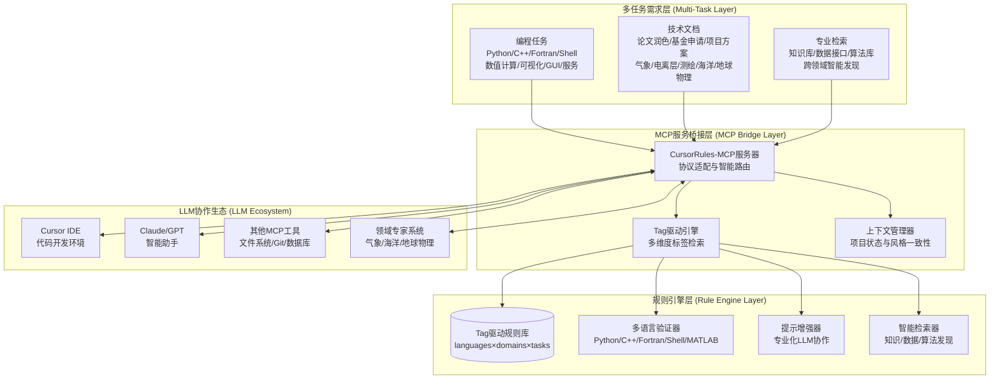

### 专业化协作流程架构

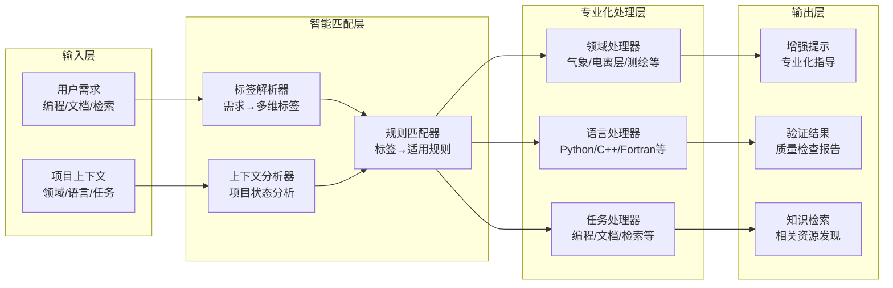

### Tag驱动的核心组件设计

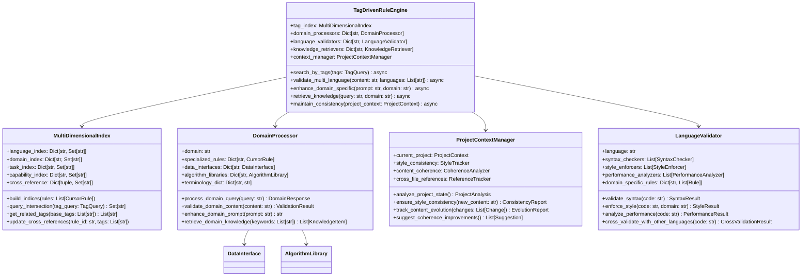

---

## 🔧 多领域协作技术路线图

### 技术演进阶段

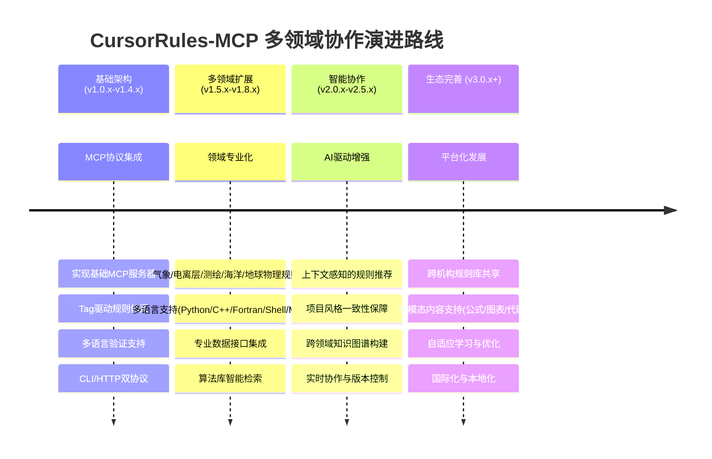

### 多领域协作技术选型

| 技术领域 | 选型 | 理由 | 多领域适配 |
|----------|------|------|----------|
| **协作架构** | MCP + Tag驱动 | 标准化协议、智能检索 | 支持跨领域规则发现与复用 |
| **多语言支持** | 插件化验证器 | 可扩展、专业化 | Python/C++/Fortran/Shell/MATLAB |
| **领域处理** | 专业化处理器 | 术语精准、算法专业 | 气象/电离层/测绘/海洋/地球物理 |
| **知识检索** | 语义索引 + 标签匹配 | 精准匹配、关联发现 | 论文/数据接口/算法库检索 |
| **上下文管理** | 项目状态跟踪 | 风格一致性、内容连贯性 | 跨文件、跨任务、跨领域协作 |
| **数据存储** | 多维索引 + 文件系统 | 高效检索、灵活扩展 | 支持规则库分布式管理 |

---

## 📊 多领域协作数据流分析

### Tag驱动的智能检索数据流

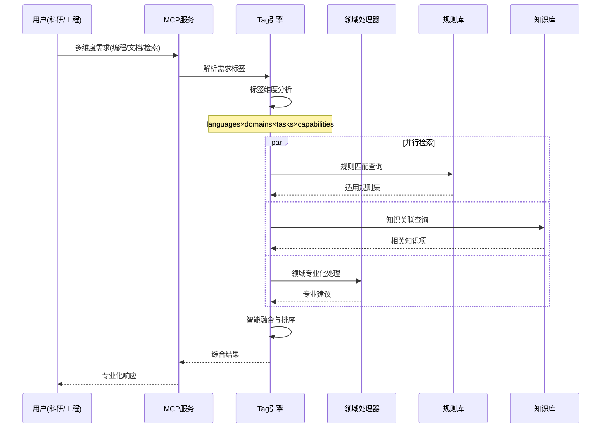

### 多语言跨领域验证数据流

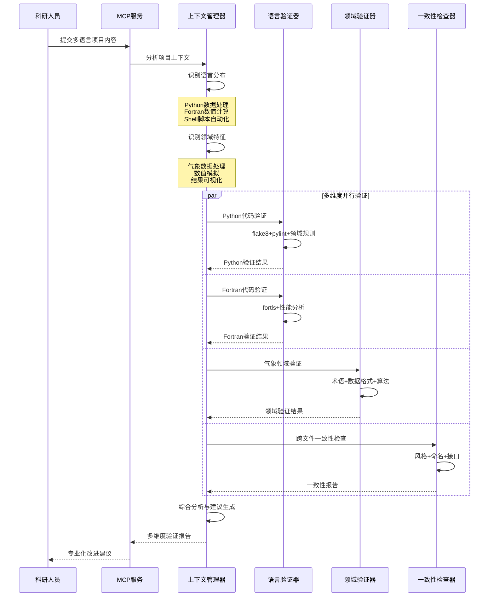

### 规则导入数据流

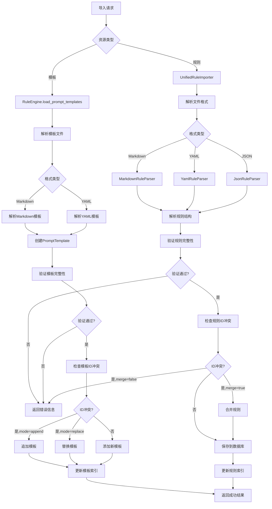

### 提示增强数据流

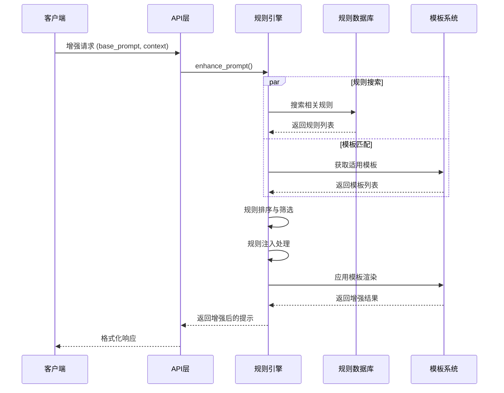

### 统计分析数据流

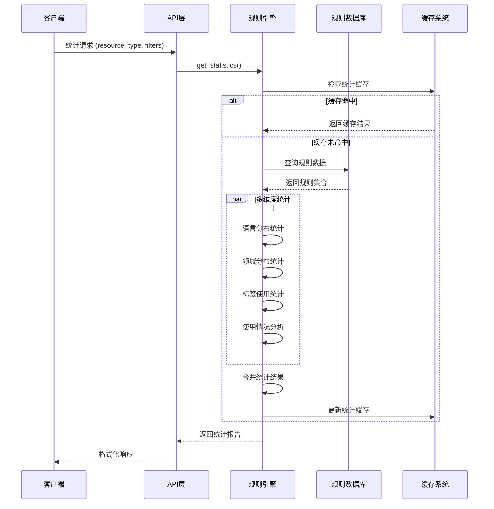

---

## 🏛️ 类设计框架

### 核心模型设计

```mermaid
classDiagram
    class CursorRule {
        +rule_id: str
        +name: str
        +version: str
        +description: str
        +rule_type: RuleType
        +languages: List[str]
        +domains: List[str]
        +content_types: List[ContentType]
        +task_types: List[TaskType]
        +tags: List[str]
        +rules: List[RuleCondition]
        +validation: RuleValidation
        +application: RuleApplication
        +author: str
        +created_at: datetime
        +active: bool
        +usage_count: int
        +success_rate: float
    }
    
    class PromptTemplate {
        +template_id: str
        +name: str
        +template: str
        +domains: List[str]
        +languages: List[str]
        +content_types: List[str]
        +description: str
        +priority: int
        +source: str
        +render(rules: str, content: str): str
    }
    
    class RuleCondition {
        +condition: str
        +guideline: str
        +priority: int
        +enforcement: bool
        +examples: List[dict]
        +pattern: Optional[str]
        +anti_pattern: Optional[str]
    }
    
    class RuleValidation {
        +tools: List[str]
        +severity: ValidationSeverity
        +auto_fix: bool
        +timeout: int
        +custom_script: Optional[str]
    }
    
    class MCPContext {
        +user_query: str
        +current_file: Optional[str]
        +project_path: Optional[str]
        +primary_language: Optional[str]
        +domain: Optional[str]
        +task_type: Optional[TaskType]
        +intent_tags: List[str]
        +complexity_level: str
        +target_audience: str
    }
    
    class ValidationResult {
        +is_valid: bool
        +score: float
        +issues: List[ValidationIssue]
        +suggestions: List[str]
        +applied_rules: List[str]
        +execution_time: float
        +context: MCPContext
    }
    
    class ValidationIssue {
        +rule_id: str
        +condition: str
        +severity: ValidationSeverity
        +message: str
        +line_number: Optional[int]
        +column: Optional[int]
        +suggestion: Optional[str]
        +auto_fixable: bool
    }
    
    CursorRule --> RuleCondition
    CursorRule --> RuleValidation
    ValidationResult --> ValidationIssue
    ValidationResult --> MCPContext
```

### 服务器架构模式

#### MCP服务器 (server.py) 设计模式

CursorRulesMCPServer采用**装饰器模式**实现MCP工具注册，通过FastMCP框架提供标准化的MCP协议支持。核心设计原则：

1. **工具导向设计** - 每个功能作为独立的MCP工具暴露
2. **异步优先** - 所有IO操作使用async/await模式
3. **类型安全** - 完整的类型注解与验证
4. **错误容错** - 完善的异常处理与日志记录

```python
# 设计模式示例
@self.mcp.tool()
async def search_rules(query: str = "", languages: str = "", ...) -> str:
    """工具函数通过装饰器自动注册到MCP协议"""
    try:
        await self._ensure_initialized()
        # 业务逻辑处理
        return formatted_result
    except Exception as e:
        logger.error(f"搜索规则时发生错误: {e}")
        return f"❌ 搜索失败: {str(e)}"
```

#### HTTP服务器 (http_server.py) 设计模式

MCPHttpServer采用**组合模式**构建REST API，通过FastAPI提供HTTP/JSON-RPC双协议支持。核心设计原则：

1. **协议桥接** - MCP协议与HTTP协议之间的适配层
2. **请求路由** - 统一的请求处理与分发机制
3. **响应标准化** - 统一的响应格式与错误处理
4. **性能优化** - 支持多进程部署与负载均衡

### 数据访问层设计

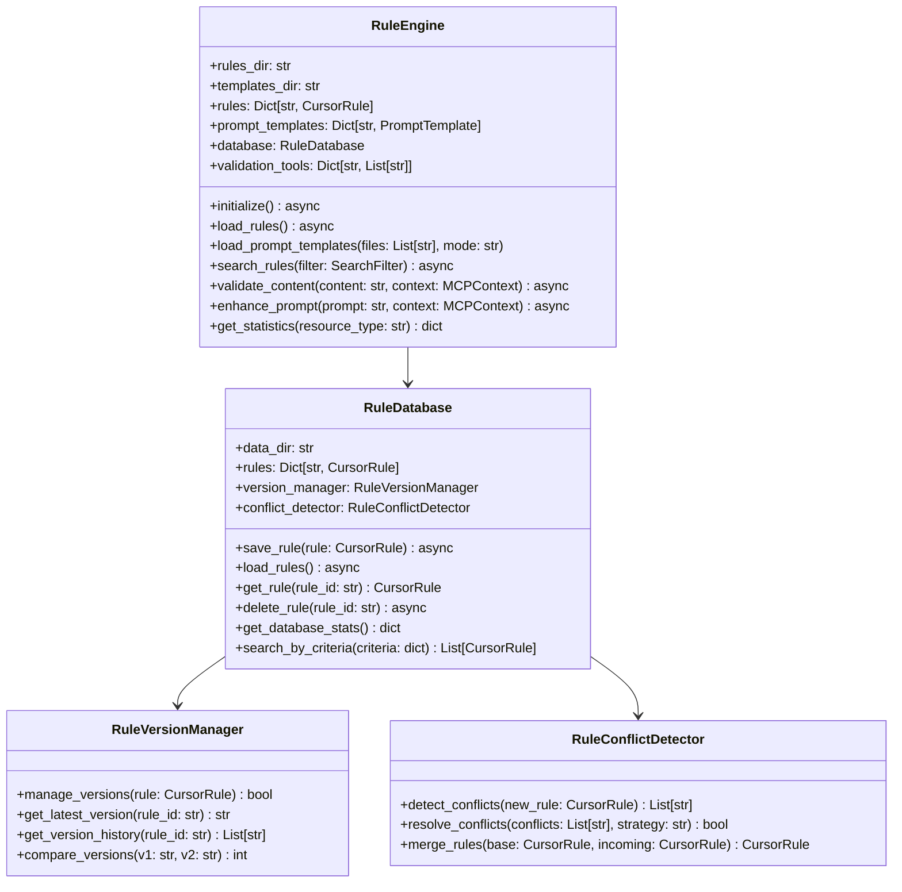

---

## 🔧 工具与验证器系统

### 验证器架构


### 支持的验证工具

| 语言 | 工具 | 检查类型 | 配置参数 |
|------|------|----------|----------|
| **Python** | Flake8 | 代码风格、语法错误 | `--max-line-length=88` |
| **Python** | Pylint | 代码质量、复杂度 | `--disable=C0103,C0114` |
| **Python** | Black | 代码格式化检查 | `--check --diff` |
| **Python** | Mypy | 类型检查 | `--ignore-missing-imports` |
| **JavaScript** | ESLint | 语法、风格、最佳实践 | `--format=json` |
| **TypeScript** | TSLint | TypeScript特定检查 | `--format=json` |
| **C++** | Clang-tidy | 静态分析、现代化建议 | `-checks=*` |
| **Markdown** | Markdownlint | 文档格式、结构 | `--json` |

---

## 📚 技术细节补充

### MCP协议实现细节

```json
{
  "jsonrpc": "2.0",
  "method": "tools/call",
  "params": {
    "name": "search_rules",
    "arguments": {
      "query": "python naming conventions",
      "languages": "python",
      "limit": 10
    }
  },
  "id": "request-123"
}
```

### HTTP API规范

```yaml
openapi: 3.0.0
info:
  title: CursorRules-MCP API
  version: 1.4.0
paths:
  /mcp/jsonrpc:
    post:
      summary: MCP JSON-RPC接口
      requestBody:
        content:
          application/json:
            schema:
              $ref: '#/components/schemas/JsonRpcRequest'
  /import_rule:
    post:
      summary: 规则导入接口
      requestBody:
        content:
          application/json:
            schema:
              $ref: '#/components/schemas/ImportRuleRequest'
```

### 配置管理

配置系统采用分层设计，支持环境变量覆盖和动态重载：

```python
# 配置优先级: 环境变量 > 配置文件 > 默认值
@dataclass
class CursorRulesConfig:
    rules_dir: str = field(default="data/rules")
    server_host: str = field(default="localhost") 
    server_port: int = field(default=8000)
    
    def __post_init__(self):
        # 环境变量覆盖
        self.rules_dir = os.getenv("CURSORRULES_RULES_DIR", self.rules_dir)
        self.server_port = int(os.getenv("CURSORRULES_PORT", self.server_port))
```

---

## ✅ 总结与展望

CursorRules-MCP通过创新的**Tag驱动架构**和**多领域协作设计**，实现了一个面向科研工程的智能规则管理与MCP服务平台。项目在多领域、多任务、多语言协作方面具有显著优势：

### 🎯 核心优势

1. **多领域专业化** - 气象、电离层、测绘、海洋、地球物理等领域的深度支持
2. **多语言协作** - Python/C++/Fortran/Shell/MATLAB的无缝集成
3. **Tag驱动智能** - 多维度标签体系实现精准规则匹配与知识发现
4. **MCP桥接服务** - 标准化协议确保LLM生态的互操作性
5. **内容风格一致性** - 跨文件、跨任务、跨领域的协作保障

### 🔧 技术创新

- **多维度索引**: languages×domains×tasks×capabilities的交叉检索
- **专业化处理器**: 领域术语、数据接口、算法库的智能集成
- **上下文管理**: 项目状态跟踪与风格一致性保障
- **知识图谱**: 跨领域关联发现与智能推荐
- **协作机制**: 实时同步与版本控制的分布式架构

### 🌍 应用价值

项目为科研工程领域提供了强大的**多领域协作基础设施**，在以下方面建立了新的标准：

- **编程任务**: 从数值计算到可视化的全链路质量控制
- **技术文档**: 从论文润色到项目方案的专业化支持  
- **知识检索**: 从文献发现到算法库的智能推荐
- **团队协作**: 从风格统一到内容连贯的一致性保障

### 🚀 未来展望

CursorRules-MCP将持续演进，致力于构建**跨机构、跨领域的科研工程协作生态**：

- **平台化发展**: 规则库共享、知识众包、协作网络
- **智能化增强**: AI驱动的规则生成、自适应学习、预测优化
- **生态化扩展**: 多模态支持、国际化部署、标准化推广

项目为现代科研工程的数字化转型提供了重要的技术支撑，具有广阔的应用前景和深远的学术价值。

---

**文档版本**: v1.4.0  
**最后更新**: 2025-06-23  
**维护团队**: Mapoet