# CursorRules-MCP 技术架构报告

**版本**: v1.4.0  
**日期**: 2025-01-23  
**作者**: Mapoet  
**机构**: NUS/STAR  

---

## 📋 技术概览

CursorRules-MCP是一个基于Model Context Protocol (MCP)的智能编程规则与提示模板管理系统。项目采用现代Python技术栈，实现了多协议服务架构，为LLM应用提供标准化的代码质量控制与内容验证服务。

### 🎯 项目定位

| 维度 | 描述 |
|------|------|
| **目标用户** | LLM开发者、代码审查团队、软件工程师、技术写作者 |
| **应用场景** | 代码生成质量控制、文档标准化、规则库管理、内容合规性校验 |
| **技术特色** | 多协议支持、异步处理、智能匹配、可扩展架构 |
| **集成方式** | MCP客户端、HTTP API、命令行工具、Python库 |

---

## 🏗️ 整体架构设计

### 系统架构图

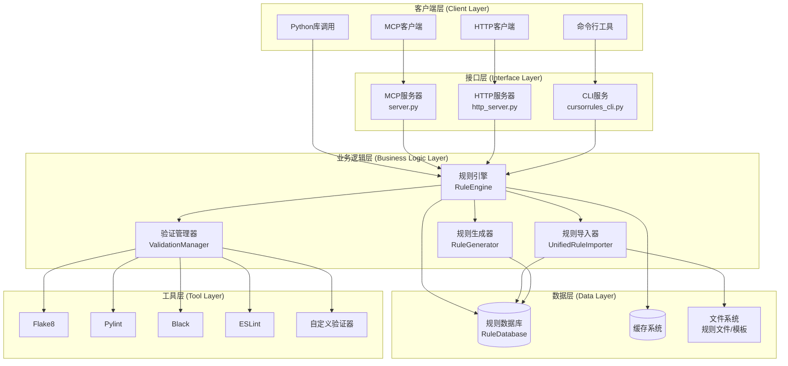

### 核心组件关系

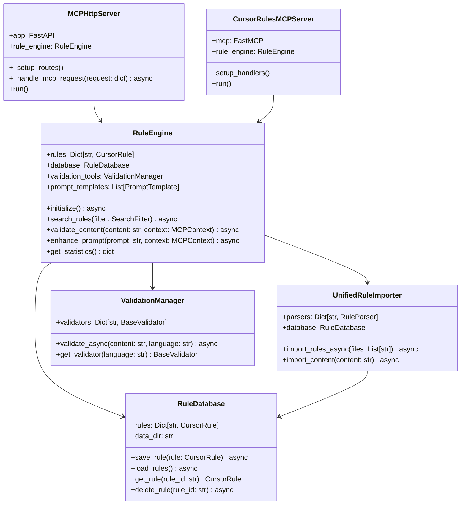

---

## 🔧 技术路线图

### 发展阶段

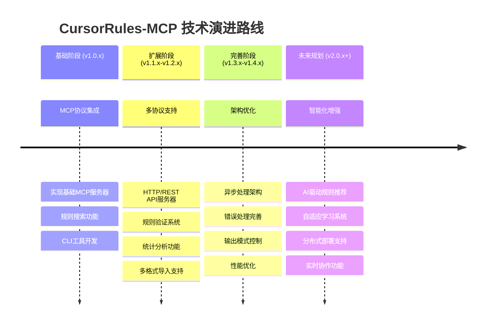

### 技术选型决策

| 技术领域 | 选型 | 理由 | 替代方案 |
|----------|------|------|----------|
| **Web框架** | FastAPI | 高性能、自动文档生成、类型安全 | Flask, Django |
| **异步框架** | asyncio | 原生支持、生态成熟 | Twisted, Tornado |
| **数据模型** | Pydantic | 类型验证、序列化支持 | dataclasses, attrs |
| **数据存储** | SQLite/PostgreSQL | 轻量级开发、生产级扩展 | MongoDB, Redis |
| **MCP实现** | FastMCP | 标准协议支持、易于集成 | 自研实现 |
| **命令行** | Click/Typer | 功能丰富、用户友好 | argparse, fire |

---

## 📊 数据流分析

### 规则搜索数据流

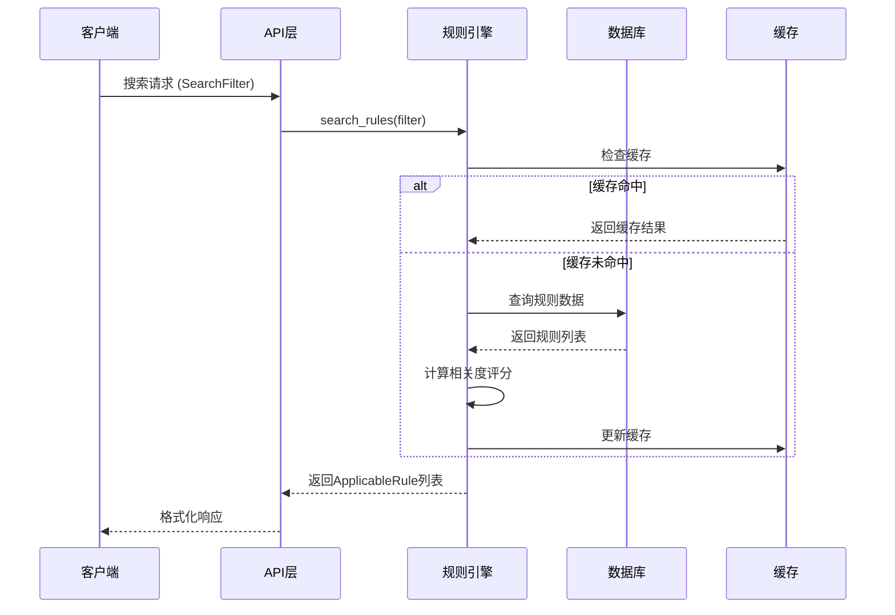

### 内容验证数据流

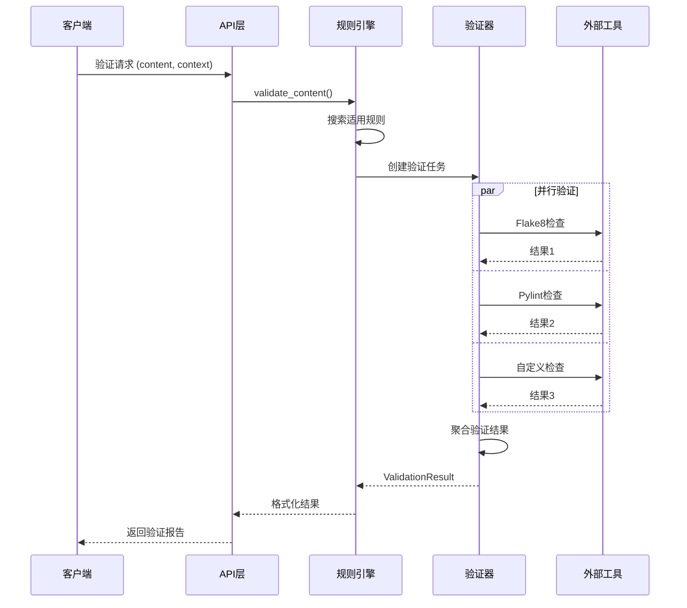

### 规则导入数据流

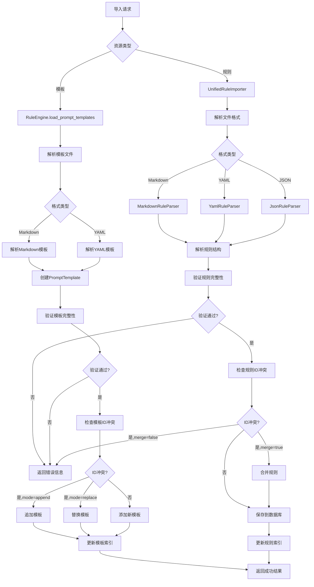

### 提示增强数据流

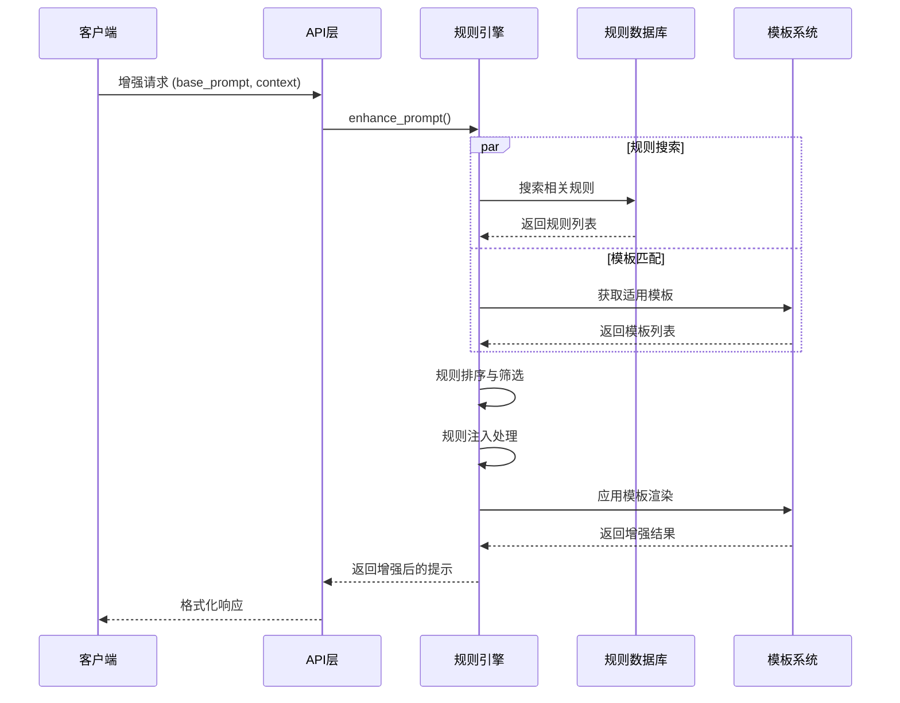

### 统计分析数据流

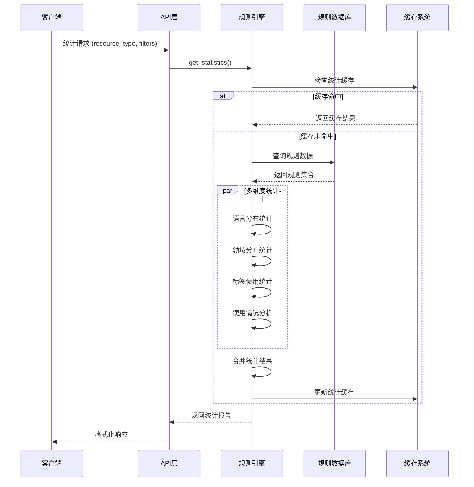

---

## 🏛️ 类设计框架

### 核心模型设计

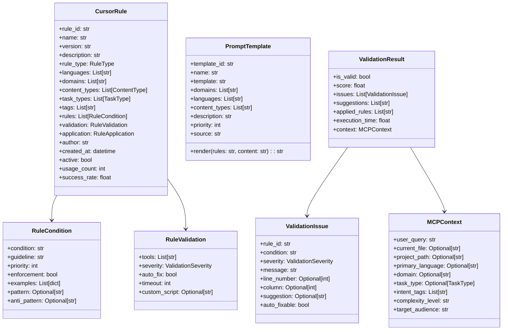

### 服务器架构模式

#### MCP服务器 (server.py) 设计模式

CursorRulesMCPServer采用**装饰器模式**实现MCP工具注册，通过FastMCP框架提供标准化的MCP协议支持。核心设计原则：

1. **工具导向设计** - 每个功能作为独立的MCP工具暴露
2. **异步优先** - 所有IO操作使用async/await模式
3. **类型安全** - 完整的类型注解与验证
4. **错误容错** - 完善的异常处理与日志记录

```python
# 设计模式示例
@self.mcp.tool()
async def search_rules(query: str = "", languages: str = "", ...) -> str:
    """工具函数通过装饰器自动注册到MCP协议"""
    try:
        await self._ensure_initialized()
        # 业务逻辑处理
        return formatted_result
    except Exception as e:
        logger.error(f"搜索规则时发生错误: {e}")
        return f"❌ 搜索失败: {str(e)}"
```

#### HTTP服务器 (http_server.py) 设计模式

MCPHttpServer采用**组合模式**构建REST API，通过FastAPI提供HTTP/JSON-RPC双协议支持。核心设计原则：

1. **协议桥接** - MCP协议与HTTP协议之间的适配层
2. **请求路由** - 统一的请求处理与分发机制
3. **响应标准化** - 统一的响应格式与错误处理
4. **性能优化** - 支持多进程部署与负载均衡

### 数据访问层设计

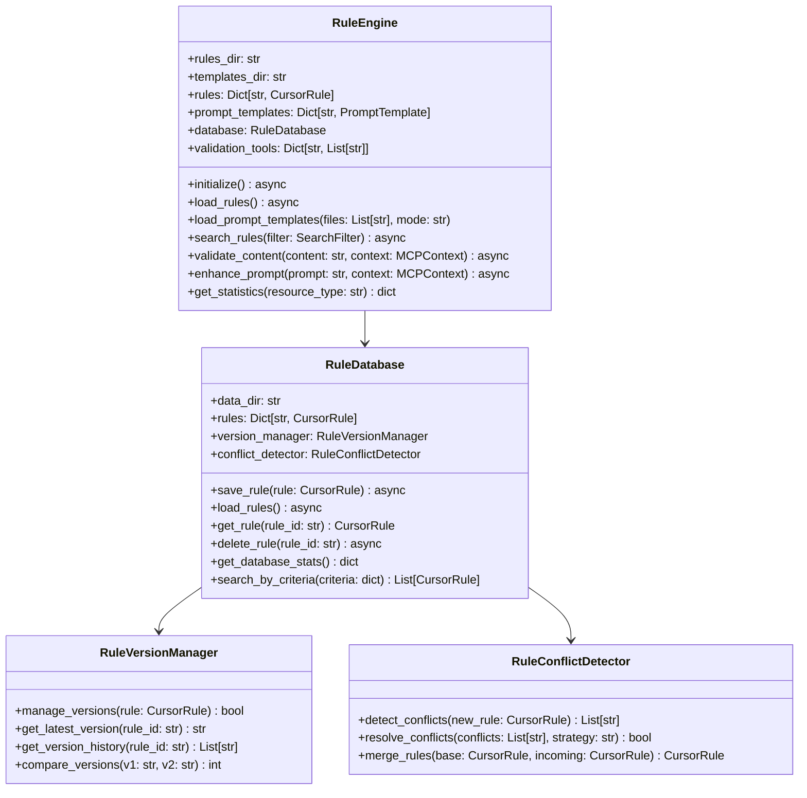

---

## 🔧 工具与验证器系统

### 验证器架构

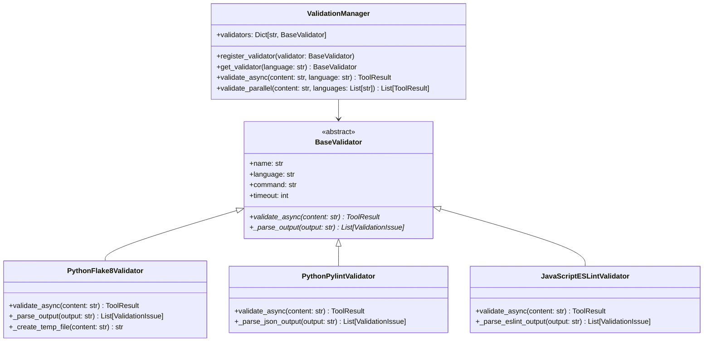

### 支持的验证工具

| 语言 | 工具 | 检查类型 | 配置参数 |
|------|------|----------|----------|
| **Python** | Flake8 | 代码风格、语法错误 | `--max-line-length=88` |
| **Python** | Pylint | 代码质量、复杂度 | `--disable=C0103,C0114` |
| **Python** | Black | 代码格式化检查 | `--check --diff` |
| **Python** | Mypy | 类型检查 | `--ignore-missing-imports` |
| **JavaScript** | ESLint | 语法、风格、最佳实践 | `--format=json` |
| **TypeScript** | TSLint | TypeScript特定检查 | `--format=json` |
| **C++** | Clang-tidy | 静态分析、现代化建议 | `-checks=*` |
| **Markdown** | Markdownlint | 文档格式、结构 | `--json` |

---

## 📚 技术细节补充

### MCP协议实现细节

```json
{
  "jsonrpc": "2.0",
  "method": "tools/call",
  "params": {
    "name": "search_rules",
    "arguments": {
      "query": "python naming conventions",
      "languages": "python",
      "limit": 10
    }
  },
  "id": "request-123"
}
```

### HTTP API规范

```yaml
openapi: 3.0.0
info:
  title: CursorRules-MCP API
  version: 1.4.0
paths:
  /mcp/jsonrpc:
    post:
      summary: MCP JSON-RPC接口
      requestBody:
        content:
          application/json:
            schema:
              $ref: '#/components/schemas/JsonRpcRequest'
  /import_rule:
    post:
      summary: 规则导入接口
      requestBody:
        content:
          application/json:
            schema:
              $ref: '#/components/schemas/ImportRuleRequest'
```

### 配置管理

配置系统采用分层设计，支持环境变量覆盖和动态重载：

```python
# 配置优先级: 环境变量 > 配置文件 > 默认值
@dataclass
class CursorRulesConfig:
    rules_dir: str = field(default="data/rules")
    server_host: str = field(default="localhost") 
    server_port: int = field(default=8000)
    
    def __post_init__(self):
        # 环境变量覆盖
        self.rules_dir = os.getenv("CURSORRULES_RULES_DIR", self.rules_dir)
        self.server_port = int(os.getenv("CURSORRULES_PORT", self.server_port))
```

---

## ✅ 总结

CursorRules-MCP通过现代化的架构设计和技术选型，实现了一个高性能、可扩展的智能规则管理系统。项目在以下方面具有显著优势：

### 🎯 核心优势

1. **多协议支持** - MCP、HTTP、CLI三位一体的接口设计
2. **异步优先** - 全链路异步处理提升并发性能
3. **智能匹配** - 多维度评分算法确保规则匹配准确性
4. **扩展性强** - 插件化验证器与模块化设计
5. **运维友好** - 完善的监控、日志与配置管理

### 🔧 技术亮点

- **现代Python栈**: FastAPI + Pydantic + SQLAlchemy的最佳实践组合
- **协议桥接**: MCP与HTTP协议的无缝适配
- **并发处理**: 多进程+异步IO的高并发架构
- **缓存策略**: 多级缓存提升系统响应速度
- **类型安全**: 完整的类型注解与运行时验证

项目为LLM应用生态提供了强大的代码质量控制基础设施，在规则管理、内容验证、提示增强等方面建立了行业标准，具有广阔的应用前景和技术价值。

---

**文档版本**: v1.4.0  
**最后更新**: 2025-06-23  
**维护团队**: Mapoet