# CursorRules-MCP 技术架构报告

**版本**: v1.4.0  
**日期**: 2025-01-23  
**作者**: Mapoet  
**机构**: NUS/STAR  

---

## 📋 技术概览

CursorRules-MCP是一个基于Model Context Protocol (MCP)的智能编程规则与提示模板管理系统。项目采用现代Python技术栈，实现了多协议服务架构，为LLM应用提供标准化的代码质量控制与内容验证服务。

### 🎯 项目定位

| 维度 | 描述 |
|------|------|
| **目标用户** | LLM开发者、代码审查团队、软件工程师、技术写作者 |
| **应用场景** | 代码生成质量控制、文档标准化、规则库管理、内容合规性校验 |
| **技术特色** | 多协议支持、异步处理、智能匹配、可扩展架构 |
| **集成方式** | MCP客户端、HTTP API、命令行工具、Python库 |

---

## 🏗️ 整体架构设计

### 系统架构图

```mermaid
graph TB
    subgraph "客户端层 (Client Layer)"
        MCP[MCP客户端]
        HTTP[HTTP客户端]
        CLI[命令行工具]
        PY[Python库调用]
    end
    
    subgraph "接口层 (Interface Layer)"
        MCPS[MCP服务器<br/>server.py]
        HTTPS[HTTP服务器<br/>http_server.py]
        CLIS[CLI服务<br/>cursorrules_cli.py]
    end
    
    subgraph "业务逻辑层 (Business Logic Layer)"
        ENGINE[规则引擎<br/>RuleEngine]
        VALIDATOR[验证管理器<br/>ValidationManager]
        IMPORTER[规则导入器<br/>UnifiedRuleImporter]
        GENERATOR[规则生成器<br/>RuleGenerator]
    end
    
    subgraph "数据层 (Data Layer)"
        DB[(规则数据库<br/>RuleDatabase)]
        CACHE[(缓存系统)]
        FILES[文件系统<br/>规则文件/模板]
    end
    
    subgraph "工具层 (Tool Layer)"
        FLAKE8[Flake8]
        PYLINT[Pylint]
        BLACK[Black]
        ESLINT[ESLint]
        CUSTOM[自定义验证器]
    end
    
    MCP --> MCPS
    HTTP --> HTTPS  
    CLI --> CLIS
    PY --> ENGINE
    
    MCPS --> ENGINE
    HTTPS --> ENGINE
    CLIS --> ENGINE
    
    ENGINE --> DB
    ENGINE --> CACHE
    ENGINE --> VALIDATOR
    ENGINE --> IMPORTER
    ENGINE --> GENERATOR
    
    VALIDATOR --> FLAKE8
    VALIDATOR --> PYLINT
    VALIDATOR --> BLACK
    VALIDATOR --> ESLINT
    VALIDATOR --> CUSTOM
    
    IMPORTER --> DB
    IMPORTER --> FILES
    GENERATOR --> DB
```

### 核心组件关系


---

## 🔧 技术路线图

### 发展阶段

```mermaid
timeline
    title CursorRules-MCP 技术演进路线
    
    section 基础阶段 (v1.0.x)
        MCP协议集成 : 实现基础MCP服务器
                   : 规则搜索功能
                   : CLI工具开发
    
    section 扩展阶段 (v1.1.x-v1.2.x)
        多协议支持 : HTTP/REST API服务器
                   : 规则验证系统
                   : 统计分析功能
                   : 多格式导入支持
    
    section 完善阶段 (v1.3.x-v1.4.x)
        架构优化 : 异步处理架构
                 : 错误处理完善
                 : 输出模式控制
                 : 性能优化
    
    section 未来规划 (v2.0.x+)
        智能化增强 : AI驱动规则推荐
                   : 自适应学习系统
                   : 分布式部署支持
                   : 实时协作功能
```

### 技术选型决策

| 技术领域 | 选型 | 理由 | 替代方案 |
|----------|------|------|----------|
| **Web框架** | FastAPI | 高性能、自动文档生成、类型安全 | Flask, Django |
| **异步框架** | asyncio | 原生支持、生态成熟 | Twisted, Tornado |
| **数据模型** | Pydantic | 类型验证、序列化支持 | dataclasses, attrs |
| **数据存储** | SQLite/PostgreSQL | 轻量级开发、生产级扩展 | MongoDB, Redis |
| **MCP实现** | FastMCP | 标准协议支持、易于集成 | 自研实现 |
| **命令行** | Click/Typer | 功能丰富、用户友好 | argparse, fire |

---

## 📊 数据流分析

### 规则搜索数据流

```mermaid
sequenceDiagram
    participant Client as 客户端
    participant API as API层
    participant Engine as 规则引擎
    participant DB as 数据库
    participant Cache as 缓存
    
    Client->>API: 搜索请求 (SearchFilter)
    API->>Engine: search_rules(filter)
    
    Engine->>Cache: 检查缓存
    alt 缓存命中
        Cache-->>Engine: 返回缓存结果
    else 缓存未命中
        Engine->>DB: 查询规则数据
        DB-->>Engine: 返回规则列表
        Engine->>Engine: 计算相关度评分
        Engine->>Cache: 更新缓存
    end
    
    Engine-->>API: 返回ApplicableRule列表
    API-->>Client: 格式化响应
```

### 内容验证数据流

```mermaid
sequenceDiagram
    participant Client as 客户端
    participant API as API层
    participant Engine as 规则引擎
    participant Validator as 验证器
    participant Tools as 外部工具
    
    Client->>API: 验证请求 (content, context)
    API->>Engine: validate_content()
    
    Engine->>Engine: 搜索适用规则
    Engine->>Validator: 创建验证任务
    
    par 并行验证
        Validator->>Tools: Flake8检查
        Tools-->>Validator: 结果1
    and
        Validator->>Tools: Pylint检查  
        Tools-->>Validator: 结果2
    and
        Validator->>Tools: 自定义检查
        Tools-->>Validator: 结果3
    end
    
    Validator->>Validator: 聚合验证结果
    Validator-->>Engine: ValidationResult
    Engine-->>API: 格式化结果
    API-->>Client: 返回验证报告
```

### 规则导入数据流

```mermaid
flowchart TD
    A[导入请求] --> B{资源类型}
    
    B -->|规则| C[UnifiedRuleImporter]
    B -->|模板| D[RuleEngine.load_prompt_templates]
    
    C --> E[解析文件格式]
    D --> F[解析模板文件]
    
    E --> G{格式类型}
    F --> H{格式类型}
    
    G -->|Markdown| I[MarkdownRuleParser]
    G -->|YAML| J[YamlRuleParser]
    G -->|JSON| K[JsonRuleParser]
    
    H -->|Markdown| L[解析Markdown模板]
    H -->|YAML| M[解析YAML模板]
    
    I --> N[解析规则结构]
    J --> N
    K --> N
    
    L --> O[创建PromptTemplate]
    M --> O
    
    N --> P[验证规则完整性]
    O --> Q[验证模板完整性]
    
    P --> R{验证通过?}
    Q --> S{验证通过?}
    
    R -->|是| T[检查规则ID冲突]
    S -->|是| U[检查模板ID冲突]
    
    R -->|否| V[返回错误信息]
    S -->|否| V
    
    T --> W{ID冲突?}
    U --> X{ID冲突?}
    
    W -->|是,merge=true| Y[合并规则]
    W -->|是,merge=false| V
    W -->|否| Z[保存到数据库]
    
    X -->|是,mode=append| AA[追加模板]
    X -->|是,mode=replace| BB[替换模板]
    X -->|否| CC[添加新模板]
    
    Y --> Z
    AA --> DD[更新模板索引]
    BB --> DD
    CC --> DD
    
    Z --> EE[更新规则索引]
    DD --> FF[返回成功结果]
    EE --> FF
```

---

## 🏛️ 类设计框架

### 核心模型设计


### 服务器架构模式

#### MCP服务器 (server.py) 设计模式

CursorRulesMCPServer采用**装饰器模式**实现MCP工具注册，通过FastMCP框架提供标准化的MCP协议支持。核心设计原则：

1. **工具导向设计** - 每个功能作为独立的MCP工具暴露
2. **异步优先** - 所有IO操作使用async/await模式
3. **类型安全** - 完整的类型注解与验证
4. **错误容错** - 完善的异常处理与日志记录

```python
# 设计模式示例
@self.mcp.tool()
async def search_rules(query: str = "", languages: str = "", ...) -> str:
    """工具函数通过装饰器自动注册到MCP协议"""
    try:
        await self._ensure_initialized()
        # 业务逻辑处理
        return formatted_result
    except Exception as e:
        logger.error(f"搜索规则时发生错误: {e}")
        return f"❌ 搜索失败: {str(e)}"
```

#### HTTP服务器 (http_server.py) 设计模式

MCPHttpServer采用**组合模式**构建REST API，通过FastAPI提供HTTP/JSON-RPC双协议支持。核心设计原则：

1. **协议桥接** - MCP协议与HTTP协议之间的适配层
2. **请求路由** - 统一的请求处理与分发机制
3. **响应标准化** - 统一的响应格式与错误处理
4. **性能优化** - 支持多进程部署与负载均衡

### 数据访问层设计


---

## 🔄 核心工作流程

### 系统初始化流程

```mermaid
flowchart TD
    A[系统启动] --> B[加载配置文件]
    B --> C[初始化日志系统]
    C --> D[创建数据库连接]
    D --> E[加载规则引擎]
    E --> F[构建规则索引]
    F --> G[初始化验证器]
    G --> H[加载提示模板]
    H --> I[启动服务监听]
    I --> J[系统就绪]
    
    style A fill:#e1f5fe
    style J fill:#c8e6c9
    style F fill:#fff3e0
    style G fill:#fff3e0
```

### 规则匹配算法

系统采用多维度评分算法进行规则匹配，确保返回最相关的规则集合：

```python
def _calculate_rule_score(self, rule: CursorRule, search_filter: SearchFilter) -> float:
    """
    多维度规则评分算法
    
    评分维度：
    1. 语言匹配度 (权重: 0.3)
    2. 领域匹配度 (权重: 0.25)  
    3. 标签匹配度 (权重: 0.2)
    4. 内容类型匹配度 (权重: 0.15)
    5. 查询相关度 (权重: 0.1)
    """
    score = 0.0
    
    # 语言匹配评分
    if search_filter.languages:
        language_score = len(set(rule.languages) & set(search_filter.languages)) / len(search_filter.languages)
        score += language_score * 0.3
    
    # 领域匹配评分  
    if search_filter.domains:
        domain_score = len(set(rule.domains) & set(search_filter.domains)) / len(search_filter.domains)
        score += domain_score * 0.25
        
    # 标签匹配评分
    if search_filter.tags:
        tag_score = len(set(rule.tags) & set(search_filter.tags)) / len(search_filter.tags)
        score += tag_score * 0.2
        
    return min(score, 1.0)
```

### 并发处理机制

```mermaid
graph LR
    A[请求队列] --> B[请求分发器]
    B --> C[工作进程1]
    B --> D[工作进程2] 
    B --> E[工作进程N]
    
    C --> F[规则引擎实例1]
    D --> G[规则引擎实例2]
    E --> H[规则引擎实例N]
    
    F --> I[共享数据库]
    G --> I
    H --> I
    
    F --> J[本地缓存1]
    G --> K[本地缓存2]
    H --> L[本地缓存N]
```

---

## 📈 性能优化策略

### 缓存策略

| 缓存层级 | 存储对象 | 生存时间 | 更新策略 |
|----------|----------|----------|----------|
| **L1 - 内存缓存** | 规则索引、搜索结果 | 1小时 | LRU淘汰 |
| **L2 - Redis缓存** | 验证结果、统计数据 | 4小时 | TTL过期 |
| **L3 - 文件缓存** | 编译结果、模板数据 | 24小时 | 定时清理 |

### 数据库优化

```sql
-- 核心查询索引优化
CREATE INDEX idx_rules_language ON rules(languages);
CREATE INDEX idx_rules_domain ON rules(domains);  
CREATE INDEX idx_rules_tags ON rules(tags);
CREATE INDEX idx_rules_active ON rules(active);
CREATE INDEX idx_rules_composite ON rules(rule_type, active, usage_count);
```

### 异步处理优化

```mermaid
sequenceDiagram
    participant Client as 客户端
    participant Gateway as API网关
    participant Worker as 工作进程
    participant Cache as 缓存
    participant DB as 数据库
    
    Client->>Gateway: 异步请求
    Gateway->>Worker: 任务分发
    
    par 并行处理
        Worker->>Cache: 检查缓存
        Worker->>DB: 数据查询
    end
    
    Worker->>Worker: 结果聚合
    Worker->>Cache: 更新缓存
    Worker->>Gateway: 返回结果
    Gateway->>Client: 响应数据
```

---

## 🔧 工具与验证器系统

### 验证器架构


### 支持的验证工具

| 语言 | 工具 | 检查类型 | 配置参数 |
|------|------|----------|----------|
| **Python** | Flake8 | 代码风格、语法错误 | `--max-line-length=88` |
| **Python** | Pylint | 代码质量、复杂度 | `--disable=C0103,C0114` |
| **Python** | Black | 代码格式化检查 | `--check --diff` |
| **Python** | Mypy | 类型检查 | `--ignore-missing-imports` |
| **JavaScript** | ESLint | 语法、风格、最佳实践 | `--format=json` |
| **TypeScript** | TSLint | TypeScript特定检查 | `--format=json` |
| **C++** | Clang-tidy | 静态分析、现代化建议 | `-checks=*` |
| **Markdown** | Markdownlint | 文档格式、结构 | `--json` |

---

## 🚀 部署与运维

### 部署架构选项

#### 单机部署
```yaml
# docker-compose.yml
version: '3.8'
services:
  cursorrules-mcp:
    build: .
    ports:
      - "8000:8000"
    environment:
      - CURSORRULES_WORKERS=4
      - CURSORRULES_LOG_LEVEL=INFO
    volumes:
      - ./data:/app/data
      - ./logs:/app/logs
```

#### 集群部署
```mermaid
graph TB
    subgraph "负载均衡层"
        LB[Nginx/HAProxy]
    end
    
    subgraph "应用层"
        APP1[CursorRules实例1]
        APP2[CursorRules实例2]
        APP3[CursorRules实例3]
    end
    
    subgraph "数据层"
        DB[(PostgreSQL集群)]
        CACHE[(Redis集群)]
        FS[共享文件系统]
    end
    
    LB --> APP1
    LB --> APP2
    LB --> APP3
    
    APP1 --> DB
    APP1 --> CACHE
    APP1 --> FS
    
    APP2 --> DB
    APP2 --> CACHE  
    APP2 --> FS
    
    APP3 --> DB
    APP3 --> CACHE
    APP3 --> FS
```

### 监控指标

| 类别 | 指标名称 | 阈值 | 监控频率 |
|------|----------|------|----------|
| **系统性能** | CPU使用率 | < 80% | 1分钟 |
| **系统性能** | 内存使用率 | < 85% | 1分钟 |
| **系统性能** | 磁盘使用率 | < 90% | 5分钟 |
| **应用性能** | 请求响应时间 | < 2秒 | 实时 |
| **应用性能** | 请求成功率 | > 99% | 实时 |
| **应用性能** | 并发连接数 | < 1000 | 1分钟 |
| **业务指标** | 规则搜索QPS | 监控 | 1分钟 |
| **业务指标** | 规则验证成功率 | > 95% | 5分钟 |
| **业务指标** | 规则总数 | 监控 | 1小时 |
| **业务指标** | 模板总数 | 监控 | 1小时 |
| **业务指标** | 规则使用率 | > 50% | 1天 |
| **业务指标** | 模板使用率 | > 30% | 1天 |

---

## 🔮 技术发展规划

### 短期目标 (v1.5.x - 6个月内)

- **🔍 搜索增强**: 实现向量搜索、语义匹配
- **🧠 智能推荐**: 基于使用历史的规则推荐算法
- **📊 仪表盘**: Web管理界面与可视化面板
- **🔗 集成扩展**: VSCode扩展、GitHub Actions支持

### 中期目标 (v2.0.x - 1年内)

- **🤖 AI驱动**: 集成大语言模型进行规则自动生成
- **🌐 多租户**: 支持多团队、多项目隔离
- **⚡ 实时协作**: WebSocket实时更新与协作编辑
- **📱 移动端**: 移动应用与离线支持

### 长期愿景 (v3.0.x+)

- **🧬 自进化**: 基于反馈的规则库自主学习与优化
- **🌍 生态系统**: 开放平台与第三方插件生态
- **🔬 领域专精**: 垂直领域（金融、医疗、航空）定制化
- **🚀 云原生**: Kubernetes原生支持与无服务器部署

---

## 📚 技术细节补充

### MCP协议实现细节

```json
{
  "jsonrpc": "2.0",
  "method": "tools/call",
  "params": {
    "name": "search_rules",
    "arguments": {
      "query": "python naming conventions",
      "languages": "python",
      "limit": 10
    }
  },
  "id": "request-123"
}
```

### HTTP API规范

```yaml
openapi: 3.0.0
info:
  title: CursorRules-MCP API
  version: 1.4.0
paths:
  /mcp/jsonrpc:
    post:
      summary: MCP JSON-RPC接口
      requestBody:
        content:
          application/json:
            schema:
              $ref: '#/components/schemas/JsonRpcRequest'
  /import_rule:
    post:
      summary: 规则导入接口
      requestBody:
        content:
          application/json:
            schema:
              $ref: '#/components/schemas/ImportRuleRequest'
```

### 配置管理

配置系统采用分层设计，支持环境变量覆盖和动态重载：

```python
# 配置优先级: 环境变量 > 配置文件 > 默认值
@dataclass
class CursorRulesConfig:
    rules_dir: str = field(default="data/rules")
    server_host: str = field(default="localhost") 
    server_port: int = field(default=8000)
    
    def __post_init__(self):
        # 环境变量覆盖
        self.rules_dir = os.getenv("CURSORRULES_RULES_DIR", self.rules_dir)
        self.server_port = int(os.getenv("CURSORRULES_PORT", self.server_port))
```

---

## ✅ 总结

CursorRules-MCP通过现代化的架构设计和技术选型，实现了一个高性能、可扩展的智能规则管理系统。项目在以下方面具有显著优势：

### 🎯 核心优势

1. **多协议支持** - MCP、HTTP、CLI三位一体的接口设计
2. **异步优先** - 全链路异步处理提升并发性能
3. **智能匹配** - 多维度评分算法确保规则匹配准确性
4. **扩展性强** - 插件化验证器与模块化设计
5. **运维友好** - 完善的监控、日志与配置管理

### 🔧 技术亮点

- **现代Python栈**: FastAPI + Pydantic + SQLAlchemy的最佳实践组合
- **协议桥接**: MCP与HTTP协议的无缝适配
- **并发处理**: 多进程+异步IO的高并发架构
- **缓存策略**: 多级缓存提升系统响应速度
- **类型安全**: 完整的类型注解与运行时验证

项目为LLM应用生态提供了强大的代码质量控制基础设施，在规则管理、内容验证、提示增强等方面建立了行业标准，具有广阔的应用前景和技术价值。

---

**文档版本**: v1.4.0  
**最后更新**: 2025-01-23  
**维护团队**: CursorRules-MCP开发组

### 核心功能实现

#### 1. 规则搜索 (search_rules)

```mermaid
flowchart TD
    A[搜索请求] --> B[解析搜索参数]
    B --> C[构建SearchFilter]
    C --> D[应用过滤条件]
    D --> E{匹配规则}
    E -->|语言| F[语言匹配]
    E -->|领域| G[领域匹配]
    E -->|标签| H[标签匹配]
    E -->|类型| I[类型匹配]
    F & G & H & I --> J[计算相关度]
    J --> K[排序结果]
    K --> L[返回结果]
```

- **输入参数**:
  - query: 搜索关键词
  - languages: 编程语言列表
  - domains: 应用领域列表
  - tags: 标签列表
  - content_types: 内容类型列表
  - rule_types: 规则类型列表
  - limit: 返回结果数量限制

- **返回结果**:
  - 规则列表（按相关度排序）
  - 每个规则包含完整元数据
  - 相关度评分
  - 使用统计信息

#### 2. 内容验证 (validate_content)

```mermaid
flowchart TD
    A[验证请求] --> B[解析内容与上下文]
    B --> C[获取适用规则]
    C --> D[规则验证循环]
    D --> E[执行规则验证]
    E --> F[收集问题]
    F --> G[生成建议]
    G --> H[计算总分]
    H --> I[返回结果]
```

- **输入参数**:
  - content: 待验证内容
  - file_path: 文件路径（可选）
  - languages: 语言列表
  - content_types: 内容类型列表
  - domains: 领域列表
  - output_mode: 输出模式

- **输出模式**:
  - result_only: 仅返回验证结果
  - result_with_prompt: 包含验证提示
  - result_with_rules: 包含规则详情
  - result_with_template: 包含模板信息
  - full: 返回全部信息

#### 3. 提示增强 (enhance_prompt)

```mermaid
flowchart TD
    A[基础提示] --> B[解析上下文]
    B --> C[搜索相关规则]
    C --> D[规则排序]
    D --> E[注入规则指导]
    E --> F[应用模板]
    F --> G[返回增强提示]
```

- **输入参数**:
  - base_prompt: 基础提示词
  - languages: 编程语言列表
  - domains: 应用领域列表
  - tags: 标签列表
  - max_rules: 最大规则数量

- **返回结果**:
  - enhanced_prompt: 增强后的提示
  - applied_rules: 应用的规则列表
  - quality_score: 质量评分

#### 4. 统计信息 (get_statistics)

```mermaid
flowchart TD
    A[统计请求] --> B{资源类型}
    B -->|规则| C[规则统计]
    B -->|模板| D[模板统计]
    B -->|全部| E[全局统计]
    
    C --> F[计算规则指标]
    D --> G[计算模板指标]
    E --> H[合并统计]
    
    F --> I[规则分布]
    G --> J[模板分布]
    H --> K[返回结果]
```

- **统计维度**:
  - 总数统计
  - 语言分布
  - 领域分布
  - 类型分布
  - 标签分布
  - 使用情况
  - 成功率

- **过滤参数**:
  - languages: 按语言过滤
  - domains: 按领域过滤
  - rule_types: 按规则类型过滤
  - tags: 按标签过滤

#### 5. 资源导入 (import_resource)

```mermaid
flowchart TD
    A[导入请求] --> B{资源类型}
    B -->|规则| C[规则导入]
    B -->|模板| D[模板导入]
    
    C --> E[解析规则]
    D --> F[解析模板]
    
    E --> G[验证规则]
    F --> H[验证模板]
    
    G --> I[检查冲突]
    H --> J[检查冲突]
    
    I -->|无冲突| K[保存规则]
    I -->|有冲突| L{处理策略}
    
    J -->|无冲突| M[保存模板]
    J -->|有冲突| N{处理策略}
    
    L -->|merge=true| O[合并规则]
    L -->|merge=false| P[报错]
    
    N -->|mode=append| Q[追加模板]
    N -->|mode=replace| R[替换模板]
    
    O --> K
    Q & R --> M
    
    K & M --> S[更新索引]
    S --> T[返回结果]
```

- **导入参数**:
  - content: 资源内容
  - type: 资源类型（rules/templates）
  - format: 文件格式
  - validate: 是否验证
  - merge: 规则合并策略
  - mode: 模板导入模式

- **支持格式**:
  - Markdown（推荐）
  - YAML
  - JSON（仅规则）

- **冲突处理**:
  - 规则：merge 策略
  - 模板：append/replace 模式